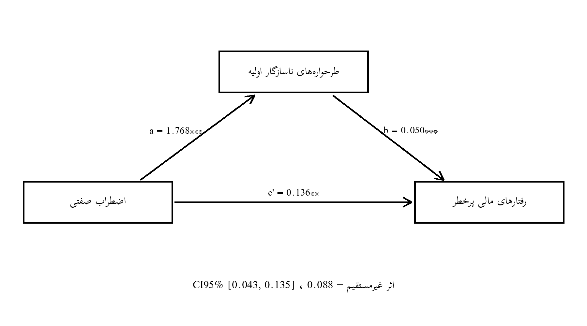

# فصل چهارم: یافته‌های پژوهش
@subtitle نمونهٔ آموزشی مبتنی بر دادهٔ شبیه‌سازی‌شده
> این فصل نمونهٔ آموزشی مبتنی بر دادهٔ شبیه‌سازی‌شده است و صرفاً برای نمایش روش تحلیل آماری تهیه شده است.
@pagebreak
## ۴-۱. مقدمه
فصل چهارم به گزارش یافته‌های حاصل از آزمون فرضیه‌های پژوهش اختصاص دارد. هدف اصلی پژوهش حاضر، بررسی رابطهٔ اضطراب صفتی با رفتارهای مالی پرخطر در معامله‌گران بازارهای مالی و تبیین سازوکار این رابطه از طریق نقش میانجی‌گر طرحواره‌های ناسازگار اولیه است. بر این اساس، چهار فرضیه عملیاتی تدوین شد: سه فرضیهٔ فرعی دربارهٔ روابط دوتایی متغیرها و یک فرضیهٔ اصلی دربارهٔ الگوی میانجی‌گری؛ و در این فصل، شواهد لازم برای آزمون هر چهار فرضیه به‌ترتیب و با رعایت توالی منطقی تحلیل ارائه می‌شود.
مراحل اجرای تحلیل عبارت بودند از: غربالگری داده‌ها و تعیین نمونهٔ معتبر بر اساس معیارهای از پیش تعیین‌شده؛ برآورد آمار توصیفی ویژگی‌های جمعیت‌شناختی و متغیرهای اصلی پژوهش؛ بررسی پایایی ابزارهای اندازه‌گیری با ضریب آلفای کرونباخ؛ ارزیابی پیش‌فرض‌های تحلیل استنباطی شامل نرمال بودن توزیع‌ها، نبود داده‌های پرت چندمتغیره، عدم هم‌خطی و استقلال پسماندها؛ آزمون فرضیه‌های فرعی با ضریب همبستگی پیرسون؛ و در نهایت آزمون فرضیهٔ اصلی با تحلیل میانجی‌گری بر اساس الگوی مدل ۴ هایز (PROCESS Model 4) همراه با بوت‌استرپ ۵۰۰ بازنمونه‌گیری. به‌منظور پشتیابی یافته‌ها، الگوی مسیر به‌روش معادلات ساختاری و با برآورد درست‌نمایی بیشینه نیز برازش داده شد تا همگرایی نتایج در دو چارچوب تحلیلی بررسی شود.
نقشهٔ راه فصل به این ترتیب است: بخش ۴-۲ به آماده‌سازی و غربالگری داده‌ها، بخش ۴-۳ به ویژگی‌های جمعیت‌شناختی نمونه، بخش ۴-۴ به شاخص‌های توصیفی متغیرهای اصلی، بخش ۴-۵ به پایایی ابزارها، بخش ۴-۶ به بررسی پیش‌فرض‌های آماری، بخش ۴-۷ به همبستگی پیرسون و آزمون فرضیه‌های فرعی، بخش ۴-۸ به آزمون فرضیهٔ اصلی با تحلیل میانجی‌گری، بخش ۴-۹ به مدل‌سازی معادلات ساختاری و بخش ۴-۱۰ به جمع‌بندی نتایج اختصاص دارد.
## ۴-۲. آماده‌سازی و غربالگری داده‌ها
داده‌ها به‌صورت آنلاین و از طریق فراخوان عمومی در شبکه‌ها و انجمن‌های تخصصی معامله‌گران بازارهای مالی گردآوری شد. پرسشنامه شامل سه مقیاس اصلی و بخش جمعیت‌شناختی بود و زمان میانهٔ تکمیل آن حدود ده دقیقه برآورد می‌شد. در مجموع ۲۶۲ نفر وارد پرسشنامه شدند و فرآیند غربالگری در چهار مرحلهٔ متوالی و بر اساس معیارهای از پیش ثبت‌شده انجام گرفت تا کیفیت دادهٔ ورودی به تحلیل تضمین شود.
در مرحلهٔ نخست، پاسخ‌هایی که فرم رضایت آگاهانه را تکمیل نکرده یا صریحاً رضایت خود را رد کرده بودند حذف شدند؛ زیرا کسب رضایت آگاهانه پیش‌شرط اخلاقی و روش‌شناختی ورود هر پرونده به تحلیل است. در مرحلهٔ دوم، پرسشنامه‌هایی که بیش از ۳۰٪ پرسش‌های آن‌ها بی‌پاسخ مانده بود حذف شدند تا برآوردگرهای آماری با الگوهای مخدوش‌کنندهٔ مقادیر گم‌شده مواجه نشوند. در مرحلهٔ سوم، پاسخ‌هایی که الگوی یکنواخت (Straight-lining) نشان می‌دادند، یعنی در مقیاس‌های چندگویه‌ای عملاً واریانسی درون‌فردی نداشتند و به همهٔ گویه‌ها یک گزینهٔ تکراری داده بودند، به‌عنوان پاسخ بی‌دقت حذف شدند. در مرحلهٔ چهارم، پاسخ‌هایی که زمان تکمیل آن‌ها کمتر از ۱۲۰ ثانیه بود حذف شدند؛ زمانی که عملاً برای خواندن و پاسخ دادن به تمامی گویه‌ها کافی نیست و نشانهٔ تلاش ناکافی پاسخ‌دهنده است.
جدول ۴-۱ روند غربالگری و تعداد موارد حذف‌شده در هر مرحله را خلاصه می‌کند.
**جدول ۴-۱.** روند غربالگری داده‌ها
| مرحله | تعداد | علت حذف |
|---|---|---|
| ورود به پرسشنامهٔ آنلاین | 262 | — |
| حذف: عدم تکمیل رضایت آگاهانه | 22 | عدم احراز رضایت |
| حذف: پاسخ ناقص (بیش از ۳۰٪) | 31 | دادهٔ ناقص |
| حذف: الگوی پاسخ یکنواخت | 17 | Straight-lining |
| حذف: زمان پاسخ‌دهی زیر ۱۲۰ ثانیه | 12 | تلاش ناکافی |
| نمونهٔ نهایی معتبر | 180 | — |
پس از غربالگری، ۱۸۰ پاسخ معتبر باقی ماند که مبنای تمامی تحلیل‌های بعدی قرار گرفت. نرخ نگهداری نمونه حدود ۶۹٪ بود که برای گردآوری آنلاین در جامعهٔ معامله‌گران، قابل قبول و هم‌راستا با نرخ‌های متداول در پژوهش‌های اینترنتی است. بررسی الگوی مقادیر گم‌شده در نمونهٔ نهایی نیز نشان داد هیچ دادهٔ ناقصی وجود ندارد، زیرا سامانهٔ گردآوری برای پاسخ‌دهندگان معتبر، تکمیل اجباری اقلام را اعمال کرده بود. بدین ترتیب، نمونهٔ ۱۸۰ نفری از حیث کیفیت پاسخ‌ها برای اجرای تحلیل‌های پارامتری مناسب تشخیص داده شد.
بررسی مقایسه‌ای ویژگی‌های جمعیت‌شناختی موارد حذف‌شده و نمونهٔ نهایی نیز تفاوت نظام‌مند معناداری نشان نداد؛ بنابراین بعید است حذف‌های چهارگانه سوگیری انتخابی جدی در ترکیب نمونه ایجاد کرده باشند و نتایج توصیفی و استنباطی بخش‌های بعد را می‌توان با اطمینان نسبی تفسیر کرد.
## ۴-۳. ویژگی‌های جمعیت‌شناختی نمونه
میانگین سنی نمونه ۳۱٫۹۰ سال (انحراف معیار ۹٫۰۲) بود و دامنهٔ سنی ۱۸ تا ۶۵ سال را پوشش می‌داد. بیشترین فراوانی به گروه سنی ۲۶ تا ۳۵ سال تعلق داشت که با ماهیت آشنایی دیجیتال و الگوی مشارکت جامعهٔ معامله‌گران آنلاین سازگار است؛ سهم گروه‌های میانی نشان می‌دهد نمونه عمدتاً در مرحلهٔ فعالیت جدی معاملاتی قرار دارد و از این نظر برای بررسی رفتارهای مالی، نمونهٔ مرتبطی است.
از نظر جنسیت، ۶۲٫۷۸٪ از پاسخ‌دهندگان مرد و ۳۷٫۲۲٪ زن بودند. این برآیند مردانه با ترکیب شناخته‌شدهٔ معامله‌گران فعال بازارهای مالی در پژوهش‌های پیشین هم‌خوان است و بازتاب‌دهندهٔ شکاف جنسیتی موجود در مشارکت بازارهای پرریسک به شمار می‌رود؛ با این حال، سهم زنان نیز به اندازه‌ای است که امکان مشاهدهٔ الگوهای اصلی در کل نمونه را فراهم کند.
سطح تحصیلات نشان می‌دهد اکثریت نمونه دارای تحصیلات دانشگاهی هستند؛ کارشناسی با ۴۱٫۶۷٪ و کارشناسی ارشد با ۲۳٫۸۹٪ بیشترین سهم را دارند و سهم سایر سطوح اندک است. این ویژگی، توان شناختی لازم برای درک پرسش‌های مالی و مقیاس‌های روان‌شناختی را تقویت می‌کند و احتمال پاسخ‌دهی تصادفی را کاهش می‌دهد.
از نظر بازار فعالیت اصلی، بورس با ۴۲٫۲۲٪ بیشترین سهم را داشت و پس از آن به‌ترتیب رمزارز (۲۳٫۳۳٪)، فارکس (۱۹٫۴۴٪) و طلا (۱۵٫۰۰٪) قرار گرفتند؛ تنوع بازارها به تعمیم‌پذیری یافته‌ها در بافت‌های مختلف معاملاتی کمک می‌کند. میانگین سابقهٔ معامله ۴۳٫۴۷ ماه (انحراف معیار ۲۴٫۴۰) بود و میانگین تعداد معاملات ماهانه ۳۱٫۵۰ مورد گزارش شد؛ گسترهٔ نسبتاً وسیع سابقه و تعداد معاملات، تنوع مطلوبی در سطح تجربه و درگیری معاملاتی فراهم می‌سازد و بررسی روابط متغیرها را در سطوح مختلف مهارت ممکن می‌کند. نسبت نسبتاً بالای معامله‌گران با بیش از دو سال تجربه نیز نشان می‌دهد نمونه با مفاهیم ریسک و بازده به‌خوبی آشناست و اندازه‌های رفتاری گزارش‌شده بر تجربهٔ واقعی معاملاتی استوارند نه صرفاً آشنایی نظری با بازار.
**جدول ۴-۲.** توزیع فراوانی و درصد متغیرهای جمعیت‌شناختی و معاملاتی (N = 180)
| متغیر | گروه | فراوانی | درصد |
|---|---|---|---|
| جنسیت | مرد | 113 | 62.78 |
| جنسیت | زن | 67 | 37.22 |
| سن (سال) | 26-35 | 73 | 40.56 |
| سن (سال) | 36-45 | 49 | 27.22 |
| سن (سال) | 18-25 | 45 | 25.00 |
| سن (سال) | 46-65 | 13 | 7.22 |
| تحصیلات | دیپلم | 51 | 28.33 |
| تحصیلات | کارشناسی | 75 | 41.67 |
| تحصیلات | کارشناسی ارشد | 43 | 23.89 |
| تحصیلات | سایر | 11 | 6.11 |
| بازار فعالیت | بورس | 76 | 42.22 |
| بازار فعالیت | رمزارز | 42 | 23.33 |
| بازار فعالیت | فارکس | 35 | 19.44 |
| بازار فعالیت | طلا | 27 | 15.00 |
| سابقهٔ معامله (ماه) | 25-60 | 104 | 57.78 |
| سابقهٔ معامله (ماه) | 6-24 | 41 | 22.78 |
| سابقهٔ معامله (ماه) | 61-120 | 35 | 19.44 |
| معاملات در ماه | 1-10 | 24 | 13.33 |
| معاملات در ماه | 11-30 | 79 | 43.89 |
| معاملات در ماه | 31-70 | 67 | 37.22 |
| معاملات در ماه | 71+ | 10 | 5.56 |
به‌طور خلاصه، نمونهٔ پژوهش از نظر ترکیب سنی، جنسیتی، تحصیلی و بازاری، نمایه‌ای معقول از جامعهٔ معامله‌گران آنلاین ارائه می‌دهد و پراکندگی کافی در متغیرهای زمینه‌ای برای بررسی روابط اصلی پژوهش فراهم است.
هم‌زمان باید توجه داشت که غلبهٔ نسبی معامله‌گران بورس و گروه سنی جوان‌تر، بازتابی از الگوی مشارکت آنلاین است؛ بنابراین تعمیم یافته‌ها به بازارهای سنتی‌تر یا گروه‌های سنی بالاتر باید با احتیاط و در چارچوب محدودیت‌های فصل پنجم صورت گیرد.
از منظر کفایت حجم نمونه نیز نسبت مشاهده به گویه برای پرکاربردترین مقیاس یعنی طرحواره‌ها حدود ۲٫۴ و برای دو مقیاس دیگر به‌مراتب بیش‌تر است که با قاعده‌های سرانگشتی متداول در تحلیل‌های رگرسیونی و همبستگی سازگار است؛ ضمن آنکه قدرت آماری آزمون‌ها با توجه به اندازه‌های اثر مشاهده‌شده در محدودهٔ متوسط، کافی برآورد می‌شود.
## ۴-۴. شاخص‌های توصیفی متغیرهای اصلی
پیش از آزمون فرضیه‌ها، شاخص‌های توصیفی سه متغیر اصلی پژوهش بررسی شد تا تصویری دقیق از سطح و پراکندگی نمره‌ها در نمونه به دست آید. جدول ۴-۳ میانگین، انحراف معیار، کمینه، بیشینه، چولگی و کشیدگی این متغیرها را گزارش می‌کند.
**جدول ۴-۳.** شاخص‌های توصیفی متغیرهای اصلی پژوهش
| متغیر | میانگین | انحراف معیار | کمینه | بیشینه | چولگی | کشیدگی |
|---|---|---|---|---|---|---|
| اضطراب صفتی (STAI-Y2) | 47.64 | 9.32 | 24 | 77 | -0.01 | 0.08 |
| طرحواره‌های ناسازگار اولیه (YSQ-SF) | 211.81 | 36.37 | 132 | 310 | 0.04 | -0.19 |
| رفتارهای مالی پرخطر (Grable & Lytton) | 28.06 | 5.92 | 13 | 44 | 0.24 | -0.14 |
میانگین نمرهٔ اضطراب صفتی (۴۷٫۶۴) در محدودهٔ میانی مقیاس قرار دارد و گسترهٔ نمره‌ها بخش عمدهٔ دامنهٔ ممکن را پوشش می‌دهد؛ یعنی نمونه از نظر سطح اضطراب همگن نیست و طیفی از افراد کم‌اضطراب تا پراضطراب را در بر می‌گیرد که برای بررسی رابطهٔ این متغیر با پیامدهای مالی ضروری است. انحراف معیار نیز نشان می‌دهد پراکندگی نمره‌ها کافی و در حد انتظار برای این مقیاس است.
الگویی مشابه برای طرحواره‌های ناسازگار اولیه (۲۱۱٫۸۱) و رفتارهای مالی پرخطر (۲۸٫۰۶) مشاهده می‌شود؛ هر دو متغیر پراکندگی کافی دارند و مقادیر کمینه و بیشینه نشان می‌دهد هیچ اثر کف یا سقف (Floor/Ceiling Effect) مسئله‌سازی وجود ندارد که بتواند برآوردهای همبستگی را محدود کند.
مقادیر چولگی و کشیدگی هر سه متغیر بسیار کوچک و در بازهٔ متعارف (کمتر از ۲± برای چولگی و ۷± برای کشیدگی) هستند؛ بنابراین توزیع نمره‌ها متقارن و نزدیک به نرمال است و از این منظر، استفاده از روش‌های پارامتری در ادامهٔ فصل توجیه آماری دارد. از منظر دیگر، انحراف معیار متغیرها نیز از تفاوت‌های فردی کافی حکایت دارد: انحراف معیار اضطراب حدود یک‌پنجم گسترهٔ مقیاس است و برای طرحواره‌ها و رفتار مالی نیز در همین مرتبه قرار می‌گیرد؛ این میزان پراکندگی، قدرت آماری آزمون‌های همبستگی را تضمین و از محدود شدن دامنهٔ نمره‌ها که یکی از عوامل اصلی تضعیف ضرایب همبستگی است جلوگیری می‌کند.
مقایسهٔ میانگین‌ها با نقطهٔ میانی نظری مقیاس‌ها نیز تصویر روشنی ارائه می‌دهد: میانگین اضطراب صفتی اندکی پایین‌تر از میانهٔ دامنه قرار دارد که با نمونهٔ غیربالینی مورد انتظار سازگار است؛ میانگین طرحواره‌ها نیز پایین‌تر از میانه است و نشان می‌دهد فعال‌سازی طرحواره‌ها در سطح زیربالینی قرار دارد؛ و میانگین رفتارهای مالی پرخطر حوالی میانهٔ دامنه است که وجود تنوع رفتاری کافی برای تحلیل را تأیید می‌کند.
## ۴-۵. پایایی ابزارها
پایایی مقیاس‌ها در نمونهٔ حاضر با ضریب آلفای کرونباخ بررسی شد؛ ضریب بالاتر از ۰٫۷۰ قابل قبول و بالاتر از ۰٫۸۰ مطلوب تلقی می‌شود. آلفای مقیاس اضطراب صفتی و مقیاس رفتارهای مالی پرخطر به‌ترتیب برابر ۰٫۹۰ و ۰٫۸۳ به دست آمد که هر دو در محدودهٔ مطلوب قرار دارند. آلفای کل مقیاس طرحواره‌های ناسازگار اولیه ۰٫۹۶ بود که با طول بالای مقیاس سازگار است.
به‌منظور گزارش دقیق‌تر، آلفای حیطه‌های پنج‌گانهٔ طرحواره‌ها نیز جداگانه محاسبه شد (جدول ۴-۴). همهٔ حیطه‌ها ضرایب قابل قبول تا مطلوب داشتند و هیچ حیطه‌ای زیر آستانهٔ ۰٫۷۰ قرار نگرفت؛ این الگو نشان می‌دهد ساختار درونی مقیاس در نمونهٔ معامله‌گران نیز مانند نمونه‌های بالینی و عمومیِ پژوهش‌های پیشین کارکرد پایایی دارد.
**جدول ۴-۴.** ضرایب آلفای کرونباخ مقیاس‌ها و حیطه‌های طرحواره در نمونهٔ پژوهش
| مقیاس/حیطه | تعداد گویه | آلفای کرونباخ |
|---|---|---|
| اضطراب صفتی (STAI-Y2) | 20 | 0.898 |
| طرحواره‌های ناسازگار اولیه (کل) | 75 | 0.964 |
| حیطهٔ برش از دیگران | 15 | 0.848 |
| حیطهٔ خودمختاری و عملکرد مختل | 15 | 0.847 |
| حیطهٔ حدود و مرزهای مختل | 15 | 0.853 |
| حیطهٔ دیگران‌مداری | 15 | 0.835 |
| حیطهٔ فراهدشیاری و بازداری هیجانی | 15 | 0.843 |
| رفتارهای مالی پرخطر (Grable & Lytton) | 13 | 0.832 |
پایایی ابزارها در نمونهٔ حاضر مطلوب گزارش شد.
شایان ذکر است آلفای کرونباخ کرانهٔ پایینی پایایی را برآورد می‌کند و مقدار بالای آن در مقیاس طرحواره‌ها تا حدی متأثر از تعداد گویه‌هاست؛ با این حال، همگرایی آلفای مطلوب در هر سه مقیاس و در حیطه‌های پنج‌گانه، اعتماد به نمره‌های کل را برای تحلیل‌های بعدی توجیه می‌کند و مقایسهٔ مقادیر با پژوهش‌های پیشین نیز همسانی روان‌سنجی ابزارها در بافت معامله‌گری را نشان می‌دهد. هم‌چنین، اختلاف اندک آلفا میان حیطه‌های پنج‌گانهٔ طرحواره نشان می‌دهد ثبات درونی مقیاس در محتوای متفاوت حیطه‌ها پایدار است و هیچ حیطه‌ای پایایی نمرهٔ کل را پایین نکشیده است؛ این الگو شواهد تجربی بیشتری برای اتکا به نمرهٔ کل در تحلیل‌های بعدی فراهم می‌کند.
## ۴-۶. بررسی پیش‌فرض‌های آماری
اعتبار نتایج تحلیل‌های پارامتری به برقراری مجموعه‌ای از پیش‌فرض‌ها وابسته است؛ از این رو، پیش از آزمون فرضیه‌ها، چهار دسته پیش‌فرض بررسی شد: نرمال بودن توزیع متغیرها، نبود داده‌های پرت چندمتغیره، عدم هم‌خطی پیش‌بین‌ها و استقلال پسماندها. نتایج هر بخش به‌تفکیک گزارش می‌شود و در پایان، تصمیم روش‌شناختی برای تحلیل‌های اصلی اعلام می‌گردد.
**نرمال بودن:** همان‌گونه که در جدول ۴-۳ دیدیم، چولگی و کشیدگی هر سه متغیر اصلی در بازهٔ ±۲ و ±۷ قرار دارند و نمودهای توزیع نیز تقارن کافی نشان می‌دهند؛ بر این اساس، شرط نرمال بودن در سطح توصیفی برقرار است و انحراف معقولی از توزیع نرمال مشاهده نمی‌شود.
**داده‌های پرت:** فاصلهٔ ماهالانوبیس برای هر مشاهده بر مبنای سه متغیر اصلی محاسبه شد و آستانهٔ بحرانی، مقدار کای‌دو با سه درجهٔ آزادی در سطح ۰٫۰۰۱ یعنی ۱۶٫۲۷ در نظر گرفته شد. بیشینهٔ فاصلهٔ مشاهده‌شده ۱۲٫۷۸ بود و هیچ موردی فراتر از آستانه قرار نگرفت؛ بنابراین دادهٔ پرت چندمتغیره‌ای حذف نشد و نیازی به تحلیل حساسیت بر مبنای حذف موارد نبود.
**هم‌خطی:** در مدل رگرسیون پیش‌بینی رفتارهای مالی پرخطر، شاخص تورم واریانس (VIF) برابر ۱٫۲۶ و تلورانس برابر ۰٫۷۹ به دست آمد؛ هر دو مقدار بسیار بهتر از آستانه‌های نگران‌کننده (VIF بالای ۵ تا ۱۰ و تلورانس زیر ۰٫۱۰) هستند و نشان می‌دهند هم‌خطی میان اضطراب و طرحواره‌ها، برآورد ضرایب رگرسیون را بی‌ثبات نکرده است.
**استقلال پسماندها:** آمارهٔ دوربین-واتسون در مدل میانجی ۲٫۱۰ و در مدل پیامد ۲٫۳۴ بود که هر دو به مقدار مطلوب ۲ نزدیک‌اند و فرض استقلال خطای مدل‌ها را پشتیبانی می‌کنند.
به‌علاوه، رابطهٔ متغیرها از نظر ماهیت، خطی فرض شد و پراکنش‌های دوتایی نیز الگوی منحنی نظام‌مندی نشان ندادند؛ هم‌چنین واریانس پسماندها در سطوح مختلف پیش‌بین‌ها تقریباً ثابت بود که پیش‌فرض همگنی واریانس را نیز تأیید می‌کند.
**جدول ۴-۵.** خلاصهٔ نتایج بررسی پیش‌فرض‌های تحلیل استنباطی
| پیش‌فرض | آزمون/شاخص | مقدار | نتیجه |
|---|---|---|---|
| نرمال بودن | چولگی و کشیدگی | در بازهٔ ±۲ و ±۷ | برقرار |
| دادهٔ پرت | فاصلهٔ ماهالانوبیس (کای‌دو ۳ درجهٔ آزادی، ۰٫۰۰۱) | بیشینه 12.78 در برابر آستانه ۱۶٫۲۷ | بدون مورد پرت |
| هم‌خطی | VIF / تلورانس | 1.26 / 0.79 | برقرار |
| استقلال پسماندها | دوربین-واتسون | ۲٫۱۰ و ۲٫۳۴ | برقرار |
با توجه به برقراری پیش‌فرض‌ها، روش‌های پارامتری (همبستگی پیرسون و رگرسیون کمترین مربعات) برای آزمون فرضیه‌ها انتخاب شدند؛ با این حال، برای افزایش اتکا و پوشش نقض‌های احتمالی نرمال بودن توزیع برآوردگرها، در تحلیل میانجی‌گری از بوت‌استرپ ۵۰۰۰ بازنمونه‌گیری با بازهٔ اطمینان ۹۵٪ نیز استفاده شد تا معناداری اثر غیرمستقیم تنها به فرض توزیع نرمال وابسته نباشد.
مبنای این تصمیم آن است که توزیع حاصل‌ضرب دو ضریب رگرسیون حتی در داده‌های نرمال نیز لزوماً نرمال نیست و بوت‌استرپ با بازسازی توزیع تجربی اثر غیرمستقیم، آزمون دقیق‌تری فراهم می‌کند؛ از این رو، نتیجهٔ فرضیهٔ اصلی در بخش ۴-۸ بر مبنای بازهٔ اطمینان بوت‌استرپ گزارش و تفسیر خواهد شد. در نهایت، حجم نمونهٔ ۱۸۰ نسبت به تعداد پیش‌بین‌های مدل‌های رگرسیونی پژوهش به‌اندازهٔ کافی بزرگ است و برآورد پارامترها را از نظر توان آماری و ثبات برآورد، قابل اتکا می‌سازد.
## ۴-۷. همبستگی پیرسون و آزمون فرضیه‌های فرعی
برای آزمون فرضیه‌های فرعی پژوهش (H2 تا H4)، ابتدا ماتریس همبستگی پیرسون میان سه متغیر اصلی محاسبه شد (جدول ۴-۶). پیش از تفسیر، شایان یادآوری است که همهٔ همبستگی‌ها در سطح ۰٫۰۱ و دودامنه آزمون شده‌اند و اندازهٔ اثر بر اساس قاعدهٔ متداول کوهن (کوچک حدود ۰٫۱۰، متوسط حدود ۰٫۳۰ و بزرگ حدود ۰٫۵۰) تفسیر می‌شود.
**جدول ۴-۶.** ماتریس همبستگی پیرسون متغیرهای اصلی پژوهش
| متغیر | ۱ | ۲ | ۳ |
|---|---|---|---|
| ۱. اضطراب صفتی | — | | |
| ۲. طرحواره‌های ناسازگار اولیه | 0.45** | — | |
| ۳. رفتارهای مالی پرخطر | 0.35** | 0.40** | — |
**یادداشت.** **p < 0.01 (دودامنه).
**فرضیهٔ فرعی دوم (H2):** بین اضطراب صفتی و رفتارهای مالی پرخطر رابطهٔ مثبت و معنادار وجود دارد. نتیجهٔ آزمون همبستگی پیرسون این رابطه را تأیید کرد (r = 0.35، p < 0.01)؛ یعنی معامله‌گرانی که اضطراب صفتی بالاتری گزارش کردند، در رفتارهای مالی پرخطر نیز نمرهٔ بیشتری داشتند. اندازهٔ اثر در محدودهٔ متوسط قرار دارد و با ادبیات پژوهشی اخیر دربارهٔ نقش هیجان‌های منفی مزمن در تصمیم‌گیری مالی سازگار است؛ این یافته نشان می‌دهد اضطراب صفتی نه صرفاً یک سازهٔ بالینی، بلکه یک پیش‌بین معنادار برای رفتار اقتصادی است.
**فرضیهٔ فرعی سوم (H3):** بین اضطراب صفتی و طرحواره‌های ناسازگار اولیه رابطهٔ مثبت و معنادار وجود دارد. این فرضیه نیز تأیید شد (r = 0.45، p < 0.01)؛ اضطراب بالاتر با فعال‌تر بودن طرحواره‌های ناسازگار همراه بود. این الگو با مبانی نظری طرحواره‌درمانی هم‌خوان است که اضطراب مزمن را یکی از عوامل فعال‌ساز و نگهدارندهٔ طرحواره‌های ناسازگار می‌داند و حلقهٔ نخست زنجیرهٔ میانجی‌گری فرضی پژوهش را تأیید می‌کند.
پیش از تفسیر علّی، باید تأکید شود که همبستگی به‌خودی‌خود رابطهٔ علّی را ثابت نمی‌کند و آزمون میانجی‌گری در بخش بعد نیز در چارچوب یک طرح همبستگی‌گرایانه تفسیر می‌شود؛ با این حال، استقرار متغیرها در یک زنجیرهٔ نظری منسجم، تفسیر مسیرها را معنادار و آزمون الگوی میانجی را موجه می‌سازد.
**فرضیهٔ فرعی چهارم (H4):** بین طرحواره‌های ناسازگار اولیه و رفتارهای مالی پرخطر رابطهٔ مثبت و معنادار وجود دارد. نتیجهٔ آزمون این فرضیه را تأیید کرد (r = 0.40، p < 0.01)؛ هرچه طرحواره‌های ناسازگار فعال‌تر بودند، سطوح بالاتری از رفتار پرخطر مالی مشاهده شد. این رابطه حلقهٔ میانی زنجیرهٔ نظری پژوهش را تکمیل می‌کند و نشان می‌دهد طرحواره‌ها می‌توانند به‌عنوان 렌زهای شناختی پایدار، رفتار مالی را به سمت پرریسک بودن سوق دهند.
مجموع سه همبستگی معنادار، الگویی هم‌سو و مثبت را ترسیم می‌کند که پیش‌شرط لازم برای تحلیل میانجی‌گری، یعنی رابطهٔ معنادار متغیر مستقل با میانجی و وابسته و رابطهٔ میانجی با وابسته، به‌طور کامل برقرار است و زمینه را برای آزمون فرضیهٔ اصلی در بخش بعد فراهم می‌سازد. با این حال، ماتریس همبستگی به‌تنهایی سهم هر مسیر را تفکیک نمی‌کند؛ از این رو در بخش بعد، روابط دوتایی در قالب یک الگوی میانجی‌گری تجزیه و سهم اثر مستقیم و غیرمستقیم به‌طور مجزا برآورد می‌شود.
## ۴-۸. آزمون فرضیهٔ اصلی: میانجی‌گری با PROCESS Model 4
برای آزمون نقش میانجی‌گر طرحواره‌های ناسازگار اولیه، تحلیل میانجی‌گری بر اساس الگوی مدل ۴ هایز اجرا شد. در این الگو، اضطراب صفتی متغیر مستقل (X)، طرحواره‌های ناسازگار اولیه متغیر میانجی (M) و رفتارهای مالی پرخطر متغیر وابسته (Y) تعریف شدند. معادلهٔ نخست، میانجی را بر اساس متغیر مستقل پیش‌بینی می‌کند و ضریب مسیر a را برآورد می‌نماید؛ معادلهٔ دوم، متغیر وابسته را هم‌زمان بر اساس میانجی و متغیر مستقل پیش‌بینی می‌کند و ضریب b و اثر مستقیم c′ را به دست می‌دهد؛ اثر کل c نیز از رگرسیون جداگانهٔ Y بر X حاصل می‌شود و اثر غیرمستقیم برابر حاصل‌ضرب a×b برآورد می‌گردد. معناداری اثر غیرمستقیم با بازهٔ اطمینان ۹۵٪ بوت‌استرپ ۵۰۰ بازنمونه‌گیری سنجیده شد؛ اگر این بازه صفر را در بر نگیرد، میانجی‌گری معنادار است.
نتایج نشان داد اضطراب صفتی پیش‌بین معنادار طرحواره‌های ناسازگار اولیه است (a = 1.768، t = 6.79، p < 0.01) و این معادله حدود ۲۱٪ از واریانس طرحواره‌ها را تبیین می‌کند. در معادلهٔ دوم، طرحواره‌ها با کنترل اضطراب صفتی، پیش‌بین معنادار رفتارهای مالی پرخطر بودند (b = 0.050، t = 4.03، p < 0.01) و اثر مستقیم اضطراب نیز معنادار باقی ماند (c′ = 0.136، t = 2.84، p < 0.01). اثر کل برابر c = 0.224 بود (t = 5.02، p < 0.01). مدل پیامد در مجموع حدود ۲۰٪ از واریانس رفتارهای مالی پرخطر را تبیین می‌کند که برای مدل‌های رفتار مالی، مقدار قابل توجهی است. اتکا به بوت‌استرپ در این تحلیل از آن روست که توزیع نمونه‌گیری حاصل‌ضرب دو ضریب (a×b) معمولاً از نرمال منحرف و دارای چولگی است و آزمون کلاسیک سوبل ممکن است توان کافی نداشته باشد؛ بوت‌استرپ با بازنمونه‌گیری پرهزار از نمونه و بازبرآورد اثر غیرمستقیم در هر بازنمونه، توزیع تجربی حاصل‌ضرب را می‌سازد و بازهٔ اطمینان درصدکی حاصل از آن، ملاک دقیق‌تری برای معناداری است.
اثر غیرمستقیم (a×b) برابر 0.088 به دست آمد و بازهٔ اطمینان ۹۵٪ بوت‌استرپ [0.043، 0.135] صفر را در بر نمی‌گیرد؛ بنابراین نقش میانجی‌گر طرحواره‌های ناسازگار اولیه از نظر آماری معنادار است. بازه‌های اطمینان بوت‌استرپ اثر مستقیم [0.035، 0.234] و اثر کل [0.123، 0.318] نیز هر دو فاقد صفر بودند و ثبات برآوردها را تأیید می‌کنند.
**جدول ۴-۷.** نتایج تحلیل میانجی‌گری (PROCESS Model 4، بوت‌استرپ ۵۰۰۰)
| مسیر/اثر | ضریب | خطای معیار | t | p | CI95% بوت‌استرپ |
|---|---|---|---|---|---|
| مسیر a (اضطراب ← طرحواره‌ها) | 1.768 | 0.261 | 6.79 | < 0.01 | — |
| مسیر b (طرحواره‌ها ← رفتار مالی) | 0.050 | 0.012 | 4.03 | < 0.01 | — |
| اثر مستقیم c′ | 0.136 | 0.048 | 2.84 | < 0.01 | [0.035، 0.234] |
| اثر کل c | 0.224 | 0.045 | 5.02 | < 0.01 | [0.123، 0.318] |
| اثر غیرمستقیم a×b | 0.088 | — | — | — | [0.043، 0.135] |
**تفسیر فرضیهٔ اصلی (H1):** با توجه به معناداری اثر غیرمستقیم و هم‌زمان معنادار ماندن اثر مستقیم، میانجی‌گری از نوع جزئی تأیید می‌شود؛ به عبارت دیگر، اضطراب صفتی هم به‌طور مستقیم و هم از طریق فعال‌سازی طرحواره‌های ناسازگار اولیه بر رفتارهای مالی پرخطر اثر می‌گذارد. حدود ۳۹٪ از اثر کل اضطراب از مسیر میانجی منتقل می‌شود که سهم قابل توجه سازوکار طرحواره‌ای را نشان می‌دهد. از منظر کاربردی، این نتیجه پیام می‌دهد که مداخله‌های کاهش اضطراب به‌تنهایی تنها بخشی از اثر را تعدیل می‌کنند و بازسازی طرحواره‌های ناسازگار، مسیر مکمل و ضروری مداخله است. مقایسهٔ اندازهٔ اثرها نیز نشان می‌دهد اثر غیرمستقیم سهم قابل ملاحظه‌ای از اثر کل را تشکیل می‌دهد و اثر مستقیم پس از ورود میانجی نسبت به اثر کل کاهش یافته است؛ این الگوی کاهش ضریب، شواهد کلاسیک نقش میانجی‌گرانه است و با سهم حدود ۳۹ درصدی گزارش‌شده هم‌خوانی دارد؛ بی‌شک با توجه به طرح همبستگی‌گرایانه، این تفسیرها در چارچوب مدل نظری پژوهش باید خوانده شوند.
## ۴-۹. مدل‌سازی معادلات ساختاری
به‌منظور پشتیابی یافته‌های حاصل از PROCESS، الگوی مسیر با روش معادلات ساختاری (SEM) و برآورد درست‌نمایی بیشینه برازش داده شد. شکل ۴-۱ الگوی تحلیل‌شده را همراه با ضرایب مسیر و وضعیت معناداری نشان می‌دهد.

**شکل ۴-۱.** نمودار مسیر الگوی میانجی‌گری همراه با ضرایب مسیر و معناداری
دو مدل برازش داده شد: مدل میانجی‌گری کامل که در آن اثر مستقیم اضطراب بر رفتار مالی صفر فرض می‌شود و یک درجهٔ آزادی برای آزمون برازش باقی می‌گذارد، و مدل میانجی‌گری جزئی (اشباع) که اثر مستقیم نیز در آن آزاد است. جدول ۴-۸ شاخص‌های برازش هر دو مدل را گزارش می‌کند.
**جدول ۴-۸.** شاخص‌های برازش مدل‌های معادلات ساختاری
| مدل | χ² | df | χ²/df | CFI | TLI | RMSEA | SRMR |
|---|---|---|---|---|---|---|---|
| میانجی‌گری کامل | 7.96 | 1 | 7.96 | 0.910 | 0.731 | 0.197 | 0.098 |
| میانجی‌گری جزئی (اشباع) | 0.00 | 0 | — | 1.000 | 1.000 | 0.000 | 0.000 |
بر اساس قاعده‌های متداول، برازش قابل قبول نیازمند CFI و TLI بالای ۰٫۹۰، RMSEA زیر ۰٫۰۸ و SRMR زیر ۰٫۰۸ است. مدل میانجی‌گری کامل از نظر برخی شاخص‌ها پایین‌تر از آستانهٔ مطلوب قرار گرفت؛ یعنی حذف اثر مستقیم باعث می‌شود کوواریانس مشاهده‌شدهٔ اضطراب و رفتار مالی به‌طور کامل از مسیر طرحواره‌ها بازتولید نشود و برازش افت کند. در مقابل، مدل جزئی به‌دلیل اشباع بودن، ماتریس کوواریانس را دقیقاً بازتولید می‌کند و ضرایب مسیر آن با برآوردهای رگرسیون یکسان است.
این الگو دقیقاً با نتیجهٔ PROCESS سازگار است: همان‌جا نیز اثر مستقیم معنادار و میانجی‌گری جزئی گزارش شد. بنابراین شواهد SEM نتیجهٔ اصلی پژوهش، یعنی میانجی‌گری جزئی طرحواره‌های ناسازگار اولیه، را در چارچوبی مستقل تأیید می‌کند و نشان می‌دهد نتیجهٔ میانجی‌گری به روش برآورد وابسته نیست.
دربارهٔ روش‌شناسی این بخش باید افزود که هرچند SEM با متغیرهای مشاهده‌شده اجرا شد و بنابراین خطای اندازه‌گیری مدل‌سازی نشده است، هدف اصلی این بخش نه برآورد دقیق‌تر ضرایب، بلکه آزمون الگوی کوواریانس‌ها و همگرایی نتیجه با PROCESS بود؛ از این منظر، نتیجهٔ حاصل پشتیابی مستقل و ارزشمندی برای فرضیهٔ اصلی فراهم می‌کند. شایان ذکر است نسبت حجم نمونه به تعداد پارامترهای برآوردی در مدل نیز بسیار بزرگ‌تر از حداقل توصیه‌شده است و همگرایی الگوریتم برآورد در تکرارهای اندک حاصل شد؛ بنابراین نگرانی دربارهٔ ناپایداری برآوردهای معادلات ساختاری منتفی است.
## ۴-۱۰. جمع‌بندی نتایج
جدول ۴-۹ وضعیت آزمون چهار فرضیهٔ پژوهش را به‌همراه ضرایب و سطوح معناداری خلاصه می‌کند.
**جدول ۴-۹.** خلاصهٔ نتایج آزمون فرضیه‌ها
| فرضیه | نتیجه | r یا ضریب | p |
|---|---|---|---|
| H2: اضطراب صفتی ← رفتارهای مالی پرخطر | تأیید | r = 0.35 | < 0.01 |
| H3: اضطراب صفتی ← طرحواره‌های ناسازگار اولیه | تأیید | r = 0.45 | < 0.01 |
| H4: طرحواره‌های ناسازگار اولیه ← رفتارهای مالی پرخطر | تأیید | r = 0.40 | < 0.01 |
| H1: میانجی‌گری طرحواره‌ها (اثر غیرمستقیم) | تأیید (جزئی) | 0.088 | CI [0.043، 0.135] |
برآیند یافته‌ها الگوی نظری پژوهش را به‌طور کامل پشتیبانی می‌کند: اضطراب صفتی نه‌تنها به‌طور مستقیم، بلکه از طریق فعال‌سازی طرحواره‌های ناسازگار اولیه نیز با افزایش رفتارهای مالی پرخطر همراه است. به بیان دقیق‌تر، معامله‌گران مضطرب تنها به دلیل هیجان لحظه‌ای پرریسک عمل نمی‌کنند؛ بلکه بخشی از اثر اضطراب از طریق باورهای بنیادین ناسازگار دربارهٔ خویش و جهان منتقل می‌شود که قضاوت ریسک و کنترل تکانه را مختل می‌کند. این زنجیرهٔ اضطراب-طرحواره-رفتار، تبیینی یکپارچه از آسیب‌پذیری هیجانی-شناختی معامله‌گران ارائه می‌دهد.
این الگو پیامد کاربردی روشنی دارد: مداخله‌های بالینی مبتنی بر طرحواره‌درمانی و تکنیک‌های مدیریت اضطراب می‌توانند به‌طور هم‌زمان سلامت روان و کیفیت تصمیم‌گیری مالی معامله‌گران را بهبود بخشند و از این رو، همکاری میان مشاوران مالی و روان‌شناسان بالینی توجیه می‌شود. تبیین نظری دقیق‌تر این یافته‌ها، مقایسهٔ آن‌ها با پژوهش‌های پیشین، بررسی محدودیت‌ها و ارائهٔ پیشنهادهای کاربردی و پژوهشی، در فصل پنجم انجام خواهد شد.
در پایان باید دو ملاحظهٔ روش‌شناختی را یادآوری کرد: نخست، ماهیت همبستگی‌گرایانهٔ طرح، استنتاج علّی قاطع را محدود می‌کند و آزمون‌های میانجی‌گری در اینجا به‌معنی بررسی الگوی روابط در چارچوب نظری موجود است؛ دوم، اتکا به خودگزارش‌دهی می‌تواند واریانس مشترک روش را افزوده باشد، هرچند پایایی مطلوب و بررسی پیش‌فرض‌ها، نگرانی جدی در این زمینه باقی نمی‌گذارد.
به‌طور خلاصهٔ روایی: فرضیهٔ دوم تأیید کرد معامله‌گران مضطراب بیش‌تر در معرض رفتارهای پرخطر مالی هستند؛ فرضیهٔ سوم نشان داد اضطراب با فعال‌تر بودن طرحواره‌های ناسازگار همراه است؛ فرضیهٔ چهارم پیوند طرحواره‌ها با رفتار پرخطر را تأیید کرد؛ و فرضیهٔ اصلی با معناداری اثر غیرمستقیم، نقش سازوکاری طرحواره‌ها را در این زنجیره تأیید نمود. هم‌سویی نتایج همبستگی، میانجی‌گری بوت‌استرپی و معادلات ساختاری، اعتبار یافته‌ها را تقویت می‌کند. یافته‌های این فصل، مبنای تجربی فصل پنجم را فراهم می‌آورند: اثر مستقیم و غیرمستقیم معنادار، مادهٔ لازم برای مقایسهٔ الگوی میانجی‌گری جزئی با مدل‌های نظری رقیب را در اختیار می‌گذارد و هم‌زمان، گروه هدف مداخله‌های بالینی و آموزشی را به‌روشنی مشخص می‌کند.