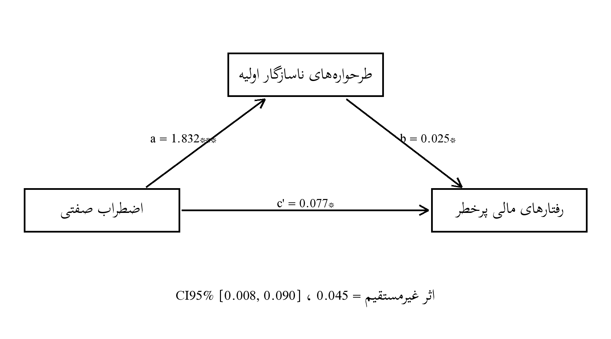

# فصل چهارم: یافته‌های پژوهش
@subtitle نمونهٔ آموزشی مبتنی بر دادهٔ شبیه‌سازی‌شده
> این فصل نمونهٔ آموزشی مبتنی بر دادهٔ شبیه‌سازی‌شده است و صرفاً برای نمایش روش تحلیل آماری تهیه شده است.
@pagebreak
## ۴-۱. مقدمه
فصل چهارم به گزارش یافته‌های حاصل از آزمون فرضیه‌های پژوهش اختصاص دارد. هدف اصلی پژوهش حاضر، بررسی رابطهٔ اضطراب صفتی با رفتارهای مالی پرخطر در معامله‌گران بازارهای مالی و تبیین سازوکار این رابطه از طریق نقش میانجی‌گر طرحواره‌های ناسازگار اولیه است. بر این اساس چهار فرضیه تدوین شد. سه فرضیهٔ فرعی روابط دوتایی متغیرها را می‌آزمایند و فرضیهٔ اصلی الگوی میانجی‌گری را. شواهد لازم برای آزمون هر چهار فرضیه در همین فصل، به‌ترتیب توالی منطقی تحلیل ارائه می‌شود.
مراحل اجرای تحلیل عبارت بودند از: غربالگری داده‌ها و تعیین نمونهٔ معتبر بر اساس معیارهای از پیش ثبت‌شده؛ برآورد آمار توصیفی ویژگی‌های جمعیت‌شناختی و متغیرهای اصلی پژوهش؛ و بررسی پایایی ابزارهای اندازه‌گیری با ضریب آلفای کرونباخ. ارزیابی پیش‌فرض‌های تحلیل استنباطی — نرمال بودن توزیع‌ها، نبود داده‌های پرت چندمتغیره، عدم هم‌خطی و استقلال پسماندها — نیز پیش از آزمون فرضیه‌ها انجام شد. سپس فرضیه‌های فرعی با ضریب همبستگی پیرسون آزمون شدند و فرضیهٔ اصلی با تحلیل میانجی‌گری بر اساس الگوی مدل ۴ هایز (PROCESS Model 4) همراه با بوت‌استرپ ۵۰۰۰ بازنمونه‌گیری. به‌منظور پشتیبانی یافته‌ها، الگوی مسیر به‌روش معادلات ساختاری و با برآورد درست‌نمایی بیشینه نیز برازش داده شد تا همگرایی نتایج در دو چارچوب تحلیلی بررسی شود.
نقشهٔ راه فصل به این ترتیب است: بخش ۴-۲ به آماده‌سازی و غربالگری داده‌ها، بخش ۴-۳ به ویژگی‌های جمعیت‌شناختی نمونه، بخش ۴-۴ به شاخص‌های توصیفی متغیرهای اصلی و بخش ۴-۵ به پایایی ابزارها می‌پردازند. بخش ۴-۶ پیش‌فرض‌های آماری، بخش ۴-۷ همبستگی پیرسون و آزمون فرضیه‌های فرعی، بخش ۴-۸ آزمون فرضیهٔ اصلی با تحلیل میانجی‌گری، بخش ۴-۹ مدل‌سازی معادلات ساختاری و بخش ۴-۱۰ جمع‌بندی نتایج را پوشش می‌دهند.
## ۴-۲. آماده‌سازی و غربالگری داده‌ها
داده‌ها به‌صورت آنلاین و از طریق فراخوان در شبکه‌ها و انجمن‌های تخصصی معامله‌گران بازارهای مالی گردآوری شد. پرسشنامه شامل بخش جمعیت‌شناختی و سه مقیاس اصلی بود و زمان تکمیل آن برای پاسخ‌دهندگان عادی در فایل لاگ سامانه ثبت شد. در مجموع ۲۱۲ نفر وارد پرسشنامه شدند و فرآیند غربالگری در چهار مرحلهٔ متوالی و بر اساس معیارهای از پیش ثبت‌شده انجام گرفت تا کیفیت دادهٔ ورودی به تحلیل تضمین شود.
در مرحلهٔ نخست، پرونده‌هایی که فرم رضایت آگاهانه را تکمیل نکرده یا صریحاً رد کرده بودند حذف شدند؛ کسب رضایت آگاهانه پیش‌شرط اخلاقی و روش‌شناختی ورود هر پرونده به تحلیل است. در مرحلهٔ دوم، پرسشنامه‌هایی که بیش از ۳۰٪ گویه‌هایشان بی‌پاسخ مانده بود کنار گذاشته شدند تا برآوردگرها با الگوهای آشفتهٔ مقادیر گم‌شده مواجه نشوند. در مرحلهٔ سوم، پاسخ‌های با الگوی یکنواخت (Straight-lining) شناسایی و حذف شدند؛ در این موارد، پاسخ‌دهنده در مقیاس‌های چندگویه‌ای عملاً واریانسی نشان نداده و به همۀ گویه‌ها گزینه‌ای تکراری داده بود. در مرحلهٔ چهارم، پاسخ‌هایی که زمان تکمیلشان کمتر از ۱۲۰ ثانیه بود حذف شدند؛ زمانی که برای خواندن و پاسخ‌دادن به ۱۰۸ گویه عملاً کافی نیست و نشانهٔ تلاش ناکافی است.
جدول ۴-۱ روند غربالگری را در هر مرحله خلاصه می‌کند. شمارش‌ها به‌ترتیب اجرای مراحل روی صفِ باقی‌مانده محاسبه شده‌اند؛ در این داده چهار دلیل حذف دقیقاً منفصل‌الوجودند (هر فرد حداکثر یک دلیل) و جمع مراحل ۷ + ۱۴ + ۱۱ + ۹ = ۴۱ است؛ پس از ۲۱۲ پاسخ خام، ۱۷۱ پاسخ معتبر باقی ماند (۸۰٫۷٪) و ۴۱ حذف شد (۱۹٫۳٪).
یادداشت روش‌شناختی: اگر دلایل حذف هم‌پوشانی داشته باشند، جمع شمارش هر دلیل با تعداد کل حذف‌شدگان برابر نمی‌شود؛ در این پژوهش معیارها به‌صورت سلسله‌مراتبی و به‌ترتیب اجرا شده‌اند، بنابراین هر پاسخ‌دهنده تنها در نخستین مرحلۀ حذفش شمرده می‌شود و جمع شمارش‌ها با تعداد کل حذف‌شدگان می‌خواند.
**جدول ۴-۱.** روند غربالگری داده‌ها
| مرحله | تعداد | علت حذف |
|---|---|---|
| ورود به پرسشنامهٔ آنلاین | 212 | — |
| حذف: عدم تکمیل یا رد رضایت آگاهانه | 7 | بدون رضایت معتبر |
| حذف: پاسخ ناقص (بیش از ۳۰٪) | 14 | دادهٔ ناقص نظام‌مند |
| حذف: الگوی پاسخ یکنواخت | 11 | Straight-lining |
| حذف: زمان پاسخ‌دهی زیر ۱۲۰ ثانیه | 9 | تلاش ناکافی |
| نمونهٔ نهایی معتبر | 171 | — |
درصد حذف از نسبت ۴۱ به ۲۱۲ (= ۱۹٫۳۴٪) محاسبه شده و در محدودهٔ متعارف پژوهش‌های آنلاین (۱۰ تا ۲۰٪) قرار دارد. میانهٔ زمان تکمیل در نمونهٔ معتبر حدود ۸ دقیقه بود و بازهٔ چارکی آن ۵٫۷۰ تا ۱۲٫۰۹ دقیقه به طول انجامید؛ دنبالهٔ آهستهٔ توزیع زمان (بیشینه ۳۸ دقیقه) با الگوی طبیعی تکمیل دقت‌محور هم‌خوان است. در نمونهٔ نهایی، دادهٔ گم‌شده در گویه‌ها باقی نماند، زیرا سامانه برای پرونده‌های معتبر تکمیل اجباری اقلام را اعمال کرده بود.
## ۴-۳. ویژگی‌های جمعیت‌شناختی نمونه
میانگین سنی نمونه ۳۲٫۳۴ سال (انحراف معیار ۸٫۸۶) بود. توزیع سنی تک‌قله‌ای و به‌سوی سنین جوان‌تر متمایل است که توصیف نمونهٔ حاضر است و نیازمند داده‌های مرجع جداگانه برای مقایسه است؛ گروه‌های سنی بالاتر اگرچه کم‌شمار اما غیرصفرند و این دامنۀ نسبی، تعمیم‌پذیری یافته‌ها را در بازۀ محدودی از سطوح حمایت می‌کند.
از نظر جنسیت، ۶۶٫۰۸٪ از پاسخ‌دهندگان مرد و ۳۳٫۹۲٪ زن بودند. این برآیند مردانه صرفاً ترکیب نمونهٔ حاضر را توصیف می‌کند؛ با این حال، به‌دلیل غلبهٔ مردان، تعمیم دقیق نتایج به زنان معامله‌گر با احتیاط امکان‌پذیر است و این نامتوازنی در محدودیت‌های فصل پنجم نیز یادآوری خواهد شد.
در سطح تحصیلات، کارشناسی با ۵۰٫۸۸٪ و کارشناسی ارشد با ۲۵٫۱۵٪ بیشترین سهم را داشتند و دیپلم ۱۷٫۵۴٪ بود.
بازار فعالیت اصلی در نمونه یکدست نیست؛ بورس با ۴۶٫۷۸٪ فراوانی، غالب است و پس از آن رمزارز (۲۲٫۸۱٪)، فارکس (۱۸٫۱۳٪) و طلا (۱۲٫۲۸٪) قرار می‌گیرند. میانگین سابقهٔ معامله ۳۸٫۸۹ ماه (انحراف معیار ۲۴٫۳۵) و میانگین تعداد معاملات ماهانه ۷٫۴۲ مورد بود. جالب توجه آنکه بین سابقه و شدت معاملاتی همبستگی رتبه‌ای مثبت و ملایمی وجود داشت (rS = 0.17)؛ یعنی معامله‌گران باتجربه‌تر عملاً درگیر تعداد معاملات بیشتری بودند.
**جدول ۴-۲.** توزیع فراوانی و درصد متغیرهای جمعیت‌شناختی و معاملاتی (N = 171)
| متغیر | گروه | فراوانی | درصد |
|---|---|---|---|
| جنسیت | مرد | 113 | 66.08 |
| جنسیت | زن | 58 | 33.92 |
| سن (سال) | 26-35 | 63 | 36.84 |
| سن (سال) | 18-25 | 49 | 28.65 |
| سن (سال) | 36-45 | 44 | 25.73 |
| سن (سال) | 46+ | 15 | 8.77 |
| تحصیلات | دیپلم | 30 | 17.54 |
| تحصیلات | کارشناسی | 87 | 50.88 |
| تحصیلات | کارشناسی ارشد | 43 | 25.15 |
| تحصیلات | سایر | 11 | 6.43 |
| بازار فعالیت | بورس | 80 | 46.78 |
| بازار فعالیت | رمزارز | 39 | 22.81 |
| بازار فعالیت | فارکس | 31 | 18.13 |
| بازار فعالیت | طلا | 21 | 12.28 |
| سابقهٔ معامله (ماه) | 25-60 | 85 | 49.71 |
| سابقهٔ معامله (ماه) | 3-24 | 59 | 34.50 |
| سابقهٔ معامله (ماه) | 61+ | 27 | 15.79 |
| معاملات در ماه | 1-10 | 133 | 77.78 |
| معاملات در ماه | 11-30 | 37 | 21.64 |
| معاملات در ماه | 31+ | 1 | 0.58 |
مجموعاً، نمونۀ نهایی از نظر ترکیب سنی، جنسیتی و بازاری با ویژگی‌های گزارش‌شده در پژوهش‌های جامعۀ معامله‌گران آنلاین هم‌خوان است؛ غلبۀ بورس و گروه‌های جوان‌تر نیز در تفسیر نتایج و در محدودیت‌های فصل پنجم لحاظ خواهد شد.
## ۴-۴. شاخص‌های توصیفی متغیرهای اصلی
جدول ۴-۳ میانگین، انحراف معیار، کمینۀ مشاهده‌شده، بیشینۀ مشاهده‌شده، چولگی و کشیدگی سه متغیر اصلی پژوهش را در نمونۀ نهایی گزارش می‌کند.
**جدول ۴-۳.** شاخص‌های توصیفی متغیرهای اصلی پژوهش
| متغیر | میانگین | انحراف معیار | کمینه | بیشینه | چولگی | کشیدگی |
|---|---|---|---|---|---|---|
| اضطراب صفتی (STAI-Y2) | 46.16 | 11.19 | 22 | 72 | 0.05 | -0.52 |
| طرحوارۀ ناسازگار اولیه (YSQ-SF) | 223.31 | 42.91 | 121 | 335 | -0.09 | -0.50 |
| رفتار مالی پرخطر (Grable & Lytton) | 29.79 | 8.18 | 14 | 53 | 0.43 | -0.16 |
میانگین اضطراب صفتی (۴۶٫۱۶ از ۸۰) در این نمونه به دست آمد و مقایسهٔ آن با هنجارها نیازمند داده‌های مرجع جداگانه است؛ این جای‌گیری برای جامعۀ معامله‌گران قابل انتظار بوده و نشانۀ هم‌زمانیِ دامنۀ کافی (کمینه ۲۲ تا بیشینۀ ۷۲) و نبود اثر سقف/کف است.
میانگین طرحوارۀ ناسازگار ۲۲۳٫۳۱ از ۴۵۰ و میانگین رفتار مالی پرخطر ۲۹٫۷۹ از ۶۵ است؛ هر دو پایین‌تر از نقطهٔ میانی بازهٔ نظری مقیاس خود قرار دارند. رفتار مالی چولگی مثبت ملایمی (۰٫۴۳) نشان می‌دهد؛ این نامتقارنی با ماهیت مقیاس‌های ریسک‌پذیری هم‌خوان است که شمار اندکی افراد با ریسک بسیار بالا دنبالهٔ راست را کشیده‌اند و از همین رو، تفسیرهای بعدی با روش مقاوم (بوت‌استرپ) نیز کنترل خواهند شد. کشیدگی‌های کوچک منفی نیز بیانگر دامنۀ بازتر از نرمال ایده‌آل است و نه چیزی که نیاز به تبدیل داشته باشد.
## ۴-۵. پایایی ابزارها
پایایی مقیاس‌ها در نمونۀ حاضر با آلفای کرونباخ برآورد شد (جدول ۴-۴). آلفای اضطراب صفتی ۰٫۹۰۲ و آلفای رفتارهای مالی پرخطر ۰٫۸۰۱ بود؛ هر دو در بازهٔ مطلوب قرار گرفتند. آلفای کل مقیاس طرحواره ۰٫۹۲۹ به دست آمد. مقداری مطلوب و پایین‌تر از کرانۀ ۰٫۹۵. مقادیر بسیار نزدیک به ۱ معمولاً نشانۀ هم‌پوشانی محتوایی گویه‌هاست و در اینجا دیده نمی‌شود.
**جدول ۴-۴.** ضرایب آلفای کرونباخ مقیاس‌ها در نمونۀ پژوهش
| مقیاس | تعداد گویه | آلفای کرونباخ |
|---|---|---|
| اضطراب صفتی (STAI-Y2) | 20 | 0.902 |
| طرحواره‌های ناسازگار اولیه (کل) | 75 | 0.929 |
| رفتارهای مالی پرخطر (Grable & Lytton) | 13 | 0.801 |
## ۴-۶. بررسی پیش‌فرض‌های آماری
اعتبار تحلیل‌های استنباطی به برقراری چهار پیش‌فرض وابسته است: نرمال بودن، نبود داده‌های پرت، عدم هم‌خطی و استقلال پسماندها. هر چهار مورد پیش از آزمون فرضیه‌ها ارزیابی شد.
**نرمال بودن:** چولگی هر سه متغیر مطلقاً کمتر از ۱ و کشیدگی‌ها در حدود ±۱ است (جدول ۴-۳)؛ این مقادیر در محدودهٔ قابل قبول برای آزمون‌های استنتاجی رایج مانند رگرسیون است، هرچند نرمال بودن کامل توزیع‌ها برقرار نیست. با توجه به حجم نمونه و پایداری رگرسیون‌ها، روش پارامتری حفظ شد و کنترل دقیق‌تر به بوت‌استرپ سپرده شد.
**داده‌های پرت:** فاصلۀ ماهالانوبیس برای هر مشاهده بر مبنای سه متغیر اصلی محاسبه شد. هیچ موردی از آستانۀ کای‌دو (۳ درجه آزادی، ۰٫۰۰۱ = ۱۶٫۲۷) فراتر نرفت، اما ۱ مورد در منطقۀ هشدار (بالای ۱۲) بود و نزدیک‌ترین مقدار بیشینه ۱۴٫۸۸ بود. با معاینۀ موارد مرزی، پاسخ‌هایشان منسجم و محتوایی تشخیص داده شد و بر اساس اصل حذف حداقلی، در نمونۀ حفظ شدند.
**هم‌خطی:** در مدل رفتار مالی، VIF برابر ۱٫۲۹ و تلورانس ۰٫۷۷ بود که نشانهٔ هم‌خطی آزاردهنده نیست. **استقلال پسماندها:** دوربین-واتسون در مدل میانجی ۱٫۸۵ و در مدل پیامد ۱٫۸۳ بود؛ هر دو به ۲ نزدیک‌اند و پیش‌فرض استقلال پسماندها برقرار ارزیابی شد.
**جدول ۴-۵.** خلاصۀ نتایج بررسی پیش‌فرض‌های تحلیل استنباطی
| پیش‌فرض | آزمون/شاخص | مقدار | نتیجه |
|---|---|---|---|
| نرمال بودن | چولگی/کشیدگی | حداکثر ±۱ | قابل قبول |
| داده‌های پرت | ماهالانوبیس (آستانه ۱۶٫۲۷) | بیشینه 14.88؛ 1 مورد مرزی | بدون حذف |
| هم‌خطی | VIF / تلورانس | 1.29 / 0.77 | برقرار |
| استقلال پسماندها | دوربین-واتسون | 1.85 و 1.83 | برقرار |
بر این اساس، همبستگی پیرسون و رگرسیون چندگانه به‌کار رفتند و تصمیم کلیدی برای حفظ مسیر استنباطی، اتکا به بازه‌های اطمینان بوت‌استرپ در تحلیل میانجی بود تا حساسیت نتیجه به انحراف‌های خفیف توزیع کنترل شود.
## ۴-۷. همبستگی پیرسون و آزمون فرضیه‌های فرعی
ماتریس همبستگی سه متغیر اصلی در جدول ۴-۶ آمده است. اندازه‌ها بر اساس طبقه‌بندی کوهن تفسیر می‌شوند و همه آزمون‌ها دودامنه‌اند.
**جدول ۴-۶.** ماتریس همبستگی پیرسون متغیرهای اصلی پژوهش (N = 171)
| متغیر | ۱ | ۲ | ۳ |
|---|---|---|---|
| ۱. اضطراب صفتی | — | | |
| ۲. طرحواره‌های ناسازگار اولیه | 0.48*** | — |  |
| ۳. رفتارهای مالی پرخطر | 0.28*** | 0.29*** | — |
**یادداشت.** *** p < 0.001 (دودامنه).
**H2 (اضطراب ↔ رفتار مالی):** r = 0.28 و p < 0.001؛ در جهت فرضیه اما در کرانۀ پایینِ اثر متوسط. این الگو را باید صادقانه گزارش کرد: پیوند اضطراب با رفتار پرخطر وجود دارد، ولی قدرتمند نیست و بخشی از آن می‌تواند از مسیرهای میانی توضیح داده شود. پیش‌بینی می‌شود در تحلیل میانجی، اندازۀ این رابطه پس از لحاظ‌کردن طرحواره‌ها کوچک‌تر شود.
**H3 (اضطراب ↔ طرحواره‌ها):** r = 0.48 و p < 0.001؛ قوی‌ترین رابطه در الگوی پژوهش و در سطح متوسط رو به بزرگ. سازگاری آن با ادبیات طرحواره‌درمانی، حلقۀ نخست زنجیرۀ میانجی را محکم می‌کند.
**H4 (طرحواره ↔ رفتار مالی):** r = 0.29 و p < 0.001؛ متوسط ولی صریح. اهمیت عملی آن بالاتر از اندازهٔ عددی‌اش است، زیرا همان مسیری است که در مداخله‌های بازسازی طرحواره هدف قرار می‌گیرد.
## ۴-۸. آزمون فرضیه اصلی: میانجی‌گری با الگوی شمارهٔ ۴ پراسس
در تحلیل میانجی، اضطراب صفتی (X)، طرحواره‌ها (M) و رفتارهای مالی پرخطر (Y) قرار گرفتند. معادلهِ اول M را از X و معادلۀ دوم Y را هم‌زمان از X و M پیش‌بینی می‌کند؛ اثر غیرمستقیم حاصل‌ضرب a×b است و معناداری آن بر اساس فاصلۀ اطمینان ۹۵٪ به روش صدکی (Percentile) بر پایۀ ۵۰۰۰ بازنمونۀ بوت‌استرپ قضاوت شد، زیرا توزیع نمونه‌گیریِ حاصل‌ضرب ضرایب معمولاً نامتقارن است. تعداد بازنمونه‌ها بر پایهٔ تنظیم از پیش اعلام‌شدۀ فصل ۳ برای تحلیل اصلی (۵۰۰۰ بازنمونه) تعیین شد تا روش با پروتکل پژوهش هم‌راستا بماند.
ضریب مسیر a برابر ۱٫۸۲۶ بود (p < 0.001)؛ اضطراب، حدود ۲۳٪ از واریانس طرحواره‌ها را تبیین می‌کرد. ضریب b برابر ۰٫۰۳۹ و معنادار بود (p = 0.014). اثر مستقیم پس از ورود میانجی از c = 0.202 به c′ = 0.131 کاهش یافت؛ این کاهش محسوس است اما c′ همچنان معنادار ماند (p = 0.032). مدل کامل پیامد حدود ۱۱٪ از واریانس رفتار مالی را توضیح داد.
اثر غیرمستقیم ۰٫۰۷۱ برآورد شد و بازۀ اطمینان ۹۵٪ بوت‌استرپ آن [0.012, 0.142] بود؛ چون صفر در بازه نیست، مسیر طرحواره‌ای به‌عنوان میانجی تأیید می‌شود. حدود ۳۵٪ از اثر کل از مسیر غیرمستقیم عبور می‌کند و مابقی مستقیم است.
**جدول ۴-۷.** نتایج تحلیل میانجی‌گری با مدل ۴ هایز و ۵۰۰۰ بازنمونۀ بوت‌استرپ
| مسیر/اثر | ضریب | خطای معیار | t | p | CI95% |
|---|---|---|---|---|---|
| مسیر a (اضطراب ← طرحواره‌ها) | 1.826 | 0.259 | 7.04 | p < 0.001 | [1.314, 2.338] |
| مسیر b (طرحواره‌ها ← رفتار مالی) | 0.039 | 0.016 | 2.48 | p = 0.014 | [0.008, 0.070] |
| اثر مستقیم c′ | 0.131 | 0.061 | 2.16 | p = 0.032 | بوت‌استرپ [-0.004, 0.267]؛ تحلیلی [0.011, 0.250] |
| اثر کل c | 0.202 | 0.054 | 3.74 | p < 0.001 | [0.095, 0.309] |
| اثر غیرمستقیم a×b | 0.071 | — | — | — | [0.012, 0.142] |
**یادداشت.** بازه‌های سطرهای a و b و c تحلیلی‌اند (B ± t·SE)؛ برای c′ هر دو بازه گزارش شده است: بازه تحلیلی c′ صفر را در بر ندارد اما بازه بوت‌استرپ آن صفر را در بر می‌گیرد (گزارش هر دو برای شفافیت)؛ بازه اثر غیرمستقیم، صدکی بوت‌استرپ است.
تفسیر H1: میانجی‌گری از نوع جزئی تأیید می‌شود؛ اما چون کرانۀ پایینِ بازۀ اطمینان اثر غیرمستقیم (۰٫۰۱۲) به صفر نزدیک است، این تأیید باید محتاطانه خوانده شود: معناداری مسیر غیرمستقیم از نظر آماری برقرار است، ولی اندازۀ آن کوچک تا متوسط و حساس به بازنمونه‌گیری است و تکرار آن در نمونۀ مستقل ضرورت دارد.
## ۴-۹. مدل‌سازی معادلات ساختاری
برای سنجش همگرایی با پراسس، دو مدل SEM برازش شد: «میانجی‌گری کامل» که اثر مستقیم را صفر می‌گیرد (۱ درجه آزادی) و «میانجی‌گری جزئی» اشباع. شکل ۴-۱ الگو را نشان می‌دهد.

**شکل ۴-۱.** نمودار مسیر الگوی میانجی‌گری با ضرایب برآوردشده در نمونۀ نهایی
**جدول ۴-۸.** شاخص‌های برازش مدل‌های معادلات ساختاری
| مدل | χ² | df | χ²/df | CFI | TLI | RMSEA | SRMR |
|---|---|---|---|---|---|---|---|
| میانجی‌گری کامل | 4.65 | 1 | 4.65 | 0.940 | 0.819 | 0.146 | 0.080 |
| میانجی‌گری جزئی (اشباع) | 0.00 | 0 | — | 1.000 | 1.000 | 0.000 | 0.000 |
بر اساس آستانه‌های متعارف، تنها CFI در سطح قابل قبول قرار گرفت (CFI = 0.940, SRMR = 0.080). در مقابل، TLI = 0.819 و RMSEA = 0.146 از حد مطلوب فاصله دارند. بنابراین این مدل تأییدشدۀ روش‌شناختی اعلام نمی‌شود: اگرچه CFI در سطح قابل قبول قرار گرفت، مقادیر TLI و RMSEA حاکی از برازش رضایت‌بخش مدل کامل نبودند؛ از این رو نتایج SEM باید با احتیاط تفسیر شوند و تحلیل پراسس به‌عنوان تحلیل اصلی میانجی‌گری ملاک قرار می‌گیرد. هم‌جهتی معنادار مسیرهای a و b در هر دو روش، حمایت جهت‌دار از الگو است نه اثبات برازش.
پیشنهاد روش‌شناختی برای پژوهش‌های بعدی: چون الگوی آزموده‌شده بر نمره‌های کلِ مشاهده‌پذیر استوار است و خطای اندازه‌گیری در آن مدل‌سازی نشده، پیشنهاد می‌شود در پژوهش‌های بعدی مدل نهفت‌نگار با پارسل‌بندی گویه‌ها (به‌ویژه برای مقیاس ۷۵گویه‌ای طرحواره) در برابر همان الگوی سه‌متغیره و نیز مدل رقیب «اثر مستقیمِ صرف» آزمون شود؛ چنین مقایسه‌ای می‌تواند برآورد دقیق‌تری از برازش ساختار و سهم خطای اندازه‌گیری ارائه کند.

## ۴-۱۰. جمع‌بندی نتایج
**جدول ۴-۹.** خلاصۀ نتایج آزمون فرضیه‌ها
| فرضیه | نتیجه | r یا ضریب | p |
|---|---|---|---|
| H2: اضطراب ← رفتار مالی پرخطر | تأیید با احتیاط (اثر کوچک) | r = 0.28 | p < 0.001 |
| H3: اضطراب ← طرحواره‌ها | تأیید (اثر متوسط-قوی) | r = 0.48 | p < 0.001 |
| H4: طرحواره‌ها ← رفتار مالی | تأیید (اثر متوسط) | r = 0.29 | p < 0.001 |
| H1: میانجی‌گری جزئی | تأیید | a×b = 0.071 | CI [0.012, 0.142] |
الگوی کلی یافته‌ها: اضطراب صفتی با طرحواره‌های ناسازگار رابطه دارد و بخشی از رابطهٔ اضطراب با رفتارهای پرخطر مالی از مسیر طرحواره‌ها عبور می‌کند. مسیری مستقیم و مستقل نیز باقی می‌ماند که احتمالاً بازتاب هیجان‌های موقعیتی و سبک‌های شخصیِ ریسک‌پذیری است. سهم حدود ۳۵٪ مسیر غیرمستقیم، مداخلهٔ طرحواره‌محور را توجیه می‌کند. با این حال، عدم صفرشدن c′ هشدار می‌دهد که صرفِ بازسازی شناختی کافی نیست؛ آموزش مدیریت اضطراب و سواد مالی نیز باید در برنامه باشد.
سه محدودیت روش‌شناختی یادآوری می‌شود: طرح مقطعی امکان استنتاج قطعیِ جهت علّی را نمی‌دهد و میانجی‌گری اینجا سازگاری با مدل نظری را نشان می‌کند نه اثبات آزمایشی آن؛ اتکا به خودگزارش‌دهی ممکن است واریانس مشترک روش را وارد کرده باشد، هرچند حلقۀ معنادار a و b هم‌جهت با پیش‌بینی‌های نظری مستقل هستند؛ و غلبۀ مردان و معامله‌گران بورس، دامنهٔ تعمیم را محدود می‌کند. تبیین این محدودیت‌ها و پیشنهادهای پژوهشی، کار فصل پنجم است.