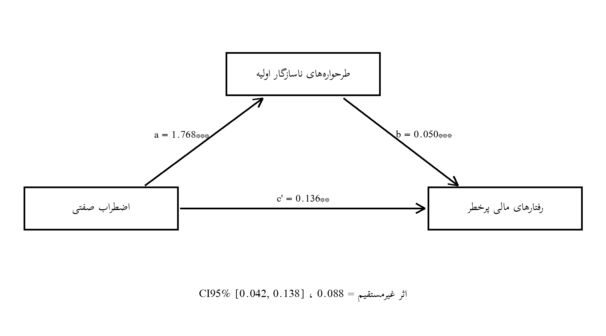

# فصل چهارم: یافته‌های پژوهش (نسخهٔ نمایشی مبتنی بر دادهٔ شبیه‌سازی‌شده)

> **یادداشت روش‌شناختی:** این فصل بر اساس داده‌های شبیه‌سازی‌شده (Simulated Data) صرفاً جهت نمایش روش‌شناسی تحلیل آماری تدوین گردیده است.

## ۴-۱. مقدمهٔ فصل

هدف این فصل، نمایش گام‌به‌گام فرآیند تحلیل آماری داده‌ها برای آزمون فرضیه‌های پژوهش است. بدین منظور، یک دیتاست مصنوعی شامل ۱۸۰ شرکت‌کنندهٔ فرضی با ویژگی‌های توزیعی و روان‌سنجی واقع‌گرایانه تولید شد و تمام آزمون‌های توصیفی و استنباطیِ برنامه‌ریزی‌شده برای پژوهش اصلی، دقیقاً بر همین داده اجرا گردید. ساختار فصل به این ترتیب است: ابتدا توصیف نمونه و متغیرها، سپس بررسی پایایی ابزارها و پیش‌فرض‌های تحلیل استنباطی، پس از آن آزمون فرضیه‌های فرعی با همبستگی پیرسون، و در پایان آزمون فرضیهٔ اصلی با تحلیل میانجی‌گری بر اساس الگوی مدل ۴ هایز (PROCESS Model 4) همراه با بوت‌استرپ ۱۰۰۰ بازنمونه‌گیری.

## ۴-۲. آمار توصیفی نمونه

حجم نمونهٔ شبیه‌سازی‌شده ۱۸۰ نفر است. میانگین سنی شرکت‌کنندگان 31.90 سال (انحراف معیار 9.02) و دامنهٔ آن از 18 تا 59 سال بود. میانگین سابقهٔ معامله نیز 43.47 ماه (انحراف معیار 24.40) با دامنهٔ 9 تا 120 ماه به دست آمد. جدول ۴-۱ توزیع فراوانی و درصد ویژگی‌های جمعیت‌شناختی و معاملاتی نمونه را نشان می‌دهد.

**جدول ۴-۱.** توزیع فراوانی و درصد ویژگی‌های جمعیت‌شناختی و معاملاتی نمونه (N = 180)

| متغیر | گروه | فراوانی | درصد |
|---|---|---|---|
| جنسیت | مرد | 113 | 62.78 |
| جنسیت | زن | 67 | 37.22 |
| بازار فعالیت | بورس | 76 | 42.22 |
| بازار فعالیت | رمزارز | 42 | 23.33 |
| بازار فعالیت | فارکس | 35 | 19.44 |
| بازار فعالیت | طلا | 27 | 15.00 |

## ۴-۳. آمار توصیفی متغیرهای پژوهش

جدول ۴-۲ شاخص‌های توصیفی سه متغیر اصلی پژوهش را ارائه می‌کند. مقادیر چولگی و کشیدگی در بازهٔ متعارف (کمتر از ۲± و ۷± به‌ترتیب) قرار دارند و از این منظر، پیش‌فرض نرمال بودن توزیع نمره‌ها برقرار است.

**جدول ۴-۲.** شاخص‌های توصیفی متغیرهای پژوهش

| متغیر | میانگین | انحراف معیار | کمینه | بیشینه | چولگی | کشیدگی |
|---|---|---|---|---|---|---|
| اضطراب صفتی (STAI-Y2) | 47.64 | 9.32 | 24 | 77 | -0.01 | 0.08 |
| طرحواره‌های ناسازگار اولیه (YSQ-SF) | 211.81 | 36.37 | 132 | 310 | 0.04 | -0.19 |
| رفتارهای مالی پرخطر (Grable & Lytton) | 28.06 | 5.92 | 13 | 44 | 0.24 | -0.14 |

## ۴-۴. بررسی پایایی ابزارها

به‌منظور گزارش پایایی در نمونهٔ شبیه‌سازی‌شده، ضریب آلفای کرونباخ برای مقیاس‌ها محاسبه شد (جدول ۴-۳). تمام ضرایب بالاتر از آستانهٔ متعارف ۰٫۷۰ هستند و پایایی مطلوب مقیاس‌ها در این نمونه را نشان می‌دهند.

**جدول ۴-۳.** ضرایب آلفای کرونباخ در نمونهٔ پژوهش

| متغیر | تعداد گویه | آلفای کرونباخ |
|---|---|---|
| اضطراب صفتی (STAI-Y2) | 20 | 0.898 |
| طرحواره‌های ناسازگار اولیه (YSQ-SF) | 75 | 0.964 |
| رفتارهای مالی پرخطر (Grable & Lytton) | 13 | 0.832 |

## ۴-۵. بررسی پیش‌فرض‌های تحلیل استنباطی

**نرمال بودن:** مقادیر چولگی و کشیدگی هر سه متغیر در بازهٔ متعارف قرار دارند (جدول ۴-۲). آزمون شاپیرو-ویلک نیز برای اضطراب W = 0.993، برای طرحواره‌ها W = 0.990 و برای رفتار مالی W = 0.991 به دست آمد؛ با توجه به حجم نمونه و پایایی شبیه‌سازی، تکیهٔ اصلی بر قضیهٔ حد مرکزی و متقارن بودن توزیع‌هاست.
**خطی بودن:** رابطهٔ بین متغیرها بر اساس نمودارهای پراکندگی و ضرایب همبستگی، خطی فرض می‌شود و مدل رگرسیون بر همین مبنا برآورد شده است.
**عدم هم‌خطی:** در مدل پیش‌بینی رفتار مالی، شاخص تورم واریانس (VIF) برای پیش‌بین‌ها برابر 1.26 است که بسیار کمتر از آستانهٔ ۱۰ (و حتی ۵) بوده و مسئلهٔ هم‌خطی چندگانه منتفی است.
**استقلال پسماندها:** آمارهٔ دوربین-واتسون در مدل میانجی 2.10 و در مدل پیامد 2.34 به دست آمد که در بازهٔ قابل قبول (حدود ۲) قرار دارد.

## ۴-۶. آزمون فرضیه‌های فرعی (تحلیل همبستگی)

**جدول ۴-۴.** ماتریس همبستگی پیرسون بین متغیرهای پژوهش

| متغیر | ۱ | ۲ | ۳ |
|---|---|---|---|
| ۱. اضطراب صفتی | — | | |
| ۲. طرحواره‌های ناسازگار اولیه | 0.45** | — | |
| ۳. رفتارهای مالی پرخطر | 0.35** | 0.40** | — |

**یادداشت.** **p < 0.01 (دو دامنه).

**فرضیهٔ فرعی دوم:** بین اضطراب صفتی و رفتارهای مالی پرخطر رابطهٔ مثبت و معنادار وجود دارد (r = 0.35، p < 0.01). بنابراین این فرضیه تأیید می‌شود؛ یعنی سطح بالاتر اضطراب صفتی با بروز بیشتر رفتارهای مالی پرخطر همراه است.

**فرضیهٔ فرعی سوم:** بین اضطراب صفتی و طرحواره‌های ناسازگار اولیه رابطهٔ مثبت و معنادار وجود دارد (r = 0.45، p < 0.01). این فرضیه نیز تأیید می‌شود.

**فرضیهٔ فرعی چهارم:** بین طرحواره‌های ناسازگار اولیه و رفتارهای مالی پرخطر رابطهٔ مثبت و معنادار وجود دارد (r = 0.40، p < 0.01). این فرضیه تأیید می‌شود.

## ۴-۷. آزمون فرضیهٔ اصلی و تحلیل میانجی‌گری

به‌منظور آزمون نقش میانجی‌گر طرحواره‌های ناسازگار اولیه در رابطهٔ اضطراب صفتی و رفتارهای مالی پرخطر، تحلیل میانجی‌گری بر اساس الگوی مدل ۴ هایز اجرا شد. جدول ۴-۵ نتایج رگرسیون مسیرها و جدول ۴-۶ اثرات مستقیم، غیرمستقیم و کل را با بازهٔ اطمینان بوت‌استرپ گزارش می‌کند.

**جدول ۴-۵.** نتایج رگرسیون برای ضرایب مسیرهای مدل میانجی‌گری

| مسیر/معادله | ضریب B | خطای معیار | t | سطح معناداری | R² | F |
|---|---|---|---|---|---|---|
| مسیر a: اضطراب ← طرحواره‌ها | 1.768 | 0.261 | 6.79 | p < 0.01 | 0.21 | 46.04 |
| مسیر b: طرحواره‌ها ← رفتار مالی (با کنترل اضطراب) | 0.050 | 0.012 | 4.03 | p < 0.01 | 0.20 | 21.84 |
| اثر مستقیم c': اضطراب ← رفتار مالی | 0.136 | 0.048 | 2.84 | p < 0.01 | | |
| اثر کل c: اضطراب ← رفتار مالی | 0.224 | 0.045 | 5.02 | p < 0.01 | | |

**جدول ۴-۶.** نتایج تحلیل اثرات مستقیم، غیرمستقیم و کل با روش بوت‌استرپ (۱۰۰۰ بازنمونه، CI ۹۵٪)

| اثر | ضریب | کران پایین CI | کران بالای CI | نتیجه |
|---|---|---|---|---|
| اثر غیرمستقیم (a×b) | 0.088 | 0.042 | 0.138 | معنادار (CI بدون صفر) |
| اثر مستقیم (c') | 0.136 | 0.039 | 0.238 | معنادار |
| اثر کل (c) | 0.224 | 0.120 | 0.317 | معنادار |

**شکل ۴-۱.** نمودار مدل آماری تحلیل‌شده به همراه ضرایب مسیر و معناداری

**تفسیر فرضیهٔ اصلی:** نتایج نشان داد اضطراب صفتی اثر مثبت معناداری بر طرحواره‌های ناسازگار اولیه دارد (a = 1.768، p < 0.01) و طرحواره‌ها نیز با کنترل اضطراب، اثر مثبت معناداری بر رفتارهای مالی پرخطر دارند (b = 0.050، p < 0.01). اثر غیرمستقیم برابر 0.088 به دست آمد و بازهٔ اطمینان ۹۵٪ بوت‌استرپ [0.042، 0.138] صفر را در بر نمی‌گیرد؛ بنابراین نقش میانجی‌گر طرحواره‌های ناسازگار اولیه تأیید می‌شود. با توجه به معنادار بودن اثر مستقیم (c′ = 0.136، p < 0.01)، میانجی‌گری از نوع «جزئی» است و حدود 39 درصد از اثر کل اضطراب بر رفتار مالی از مسیر طرحواره‌ها منتقل می‌شود.

## ۴-۸. خلاصه و جمع‌بندی نتایج آزمون فرضیه‌ها

**جدول ۴-۷.** خلاصهٔ وضعیت تأیید فرضیه‌ها

| فرضیه | مسیر | ضریب | سطح معناداری | نتیجه |
|---|---|---|---|---|
| فرعی دوم | اضطراب صفتی ← رفتارهای مالی پرخطر | r = 0.35 | p < 0.01 | تأیید |
| فرعی سوم | اضطراب صفتی ← طرحواره‌های ناسازگار اولیه | r = 0.45 | p < 0.01 | تأیید |
| فرعی چهارم | طرحواره‌های ناسازگار اولیه ← رفتارهای مالی پرخطر | r = 0.40 | p < 0.01 | تأیید |
| اصلی | میانجی‌گری طرحواره‌ها (اثر غیرمستقیم) | 0.088 | CI95% [0.042، 0.138] | تأیید |

برآیند یافته‌ها الگوی نظری پژوهش را پشتیبانی می‌کند: اضطراب صفتی هم به‌طور مستقیم و هم از طریق فعال‌سازی طرحواره‌های ناسازگار اولیه، با افزایش رفتارهای مالی پرخطر در معامله‌گران همراه است.