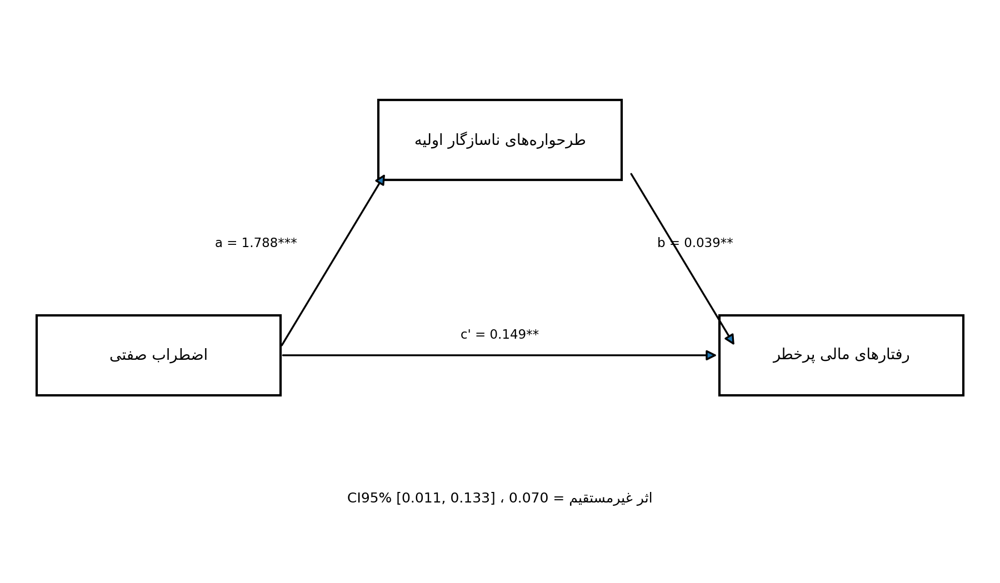

# فصل چهارم: یافته‌های پژوهش
@subtitle نمونهٔ آموزشی مبتنی بر دادهٔ شبیه‌سازی‌شده
> این فصل نمونهٔ آموزشی مبتنی بر دادهٔ شبیه‌سازی‌شده است و صرفاً برای نمایش روش تحلیل آماری تهیه شده است.
@pagebreak
## ۴-۱. مقدمه
فصل چهارم به گزارش یافته‌های حاصل از آزمون فرضیه‌های پژوهش اختصاص دارد. هدف اصلی پژوهش حاضر، بررسی رابطهٔ اضطراب صفتی با رفتارهای مالی پرخطر در معامله‌گران بازارهای مالی و تبیین سازوکار این رابطه از طریق نقش میانجی طرحواره‌های ناسازگار اولیه است. بر این اساس چهار فرضیه تدوین شد: سه فرضیهٔ فرعی روابط دوتایی متغیرها را می‌آزمایند و فرضیهٔ اصلی الگوی میانجی‌گری را. فرضیهٔ اول (اصلی) بیان می‌کند که طرحواره‌های ناسازگار اولیه رابطهٔ میان اضطراب صفتی و رفتارهای مالی پرخطر را میانجی‌گری می‌کند؛ فرضیهٔ دوم از رابطهٔ مثبت معنادار میان اضطراب صفتی و رفتارهای مالی پرخطر حکایت دارد؛ فرضیهٔ سوم رابطهٔ مثبت معنادار میان اضطراب صفتی و طرحواره‌های ناسازگار اولیه را پیش‌بینی می‌کند؛ و فرضیهٔ چهارم نیز رابطهٔ مثبت معنادار میان طرحواره‌های ناسازگار اولیه و رفتارهای مالی پرخطر را مطرح می‌سازد.
مراحل اجرای تحلیل عبارت بودند از: غربالگری داده‌ها و تعیین نمونهٔ معتبر بر اساس معیارهای از پیش تعیین‌شده؛ برآورد آمار توصیفی ویژگی‌های جمعیت‌شناختی و متغیرهای اصلی پژوهش؛ و بررسی پایایی ابزارهای اندازه‌گیری با ضریب آلفای کرونباخ. ارزیابی پیش‌فرض‌های تحلیل استنباطی — شامل شکل توزیع‌ها، نبود داده‌های پرت چندمتغیره، عدم هم‌خطی و استقلال پسماندها — نیز پیش از آزمون فرضیه‌ها انجام شد. سپس فرضیه‌های فرعی با ضریب همبستگی پیرسون آزمون شدند و فرضیهٔ اصلی با تحلیل میانجی‌گری بر اساس الگوی شمارهٔ ۴ هایز همراه با خودگردان‌سازی ۵۰۰۰ نمونه‌ای. به‌منظور بررسی همگرایی، الگوی مسیر با متغیرهای مشاهده‌شده و برآورد درست‌نمایی بیشینه نیز برازش داده شد.
نقشهٔ راه فصل به این ترتیب است: بخش ۴-۲ به آماده‌سازی و غربالگری داده‌ها، بخش ۴-۳ به ویژگی‌های جمعیت‌شناختی نمونه، بخش ۴-۴ به شاخص‌های توصیفی متغیرهای اصلی و بخش ۴-۵ به پایایی ابزارها می‌پردازند. بخش ۴-۶ پیش‌فرض‌های آماری، بخش ۴-۷ همبستگی پیرسون و آزمون فرضیه‌های فرعی، بخش ۴-۸ آزمون فرضیهٔ اصلی با تحلیل میانجی‌گری، بخش ۴-۹ تحلیل مسیر با متغیرهای مشاهده‌شده و بخش ۴-۱۰ جمع‌بندی نتایج را پوشش می‌دهند.
## ۴-۲. آماده‌سازی و غربالگری داده‌ها
پرسشنامهٔ آنلاین در مجموع ۲۴۳ پاسخ خام دریافت کرد. غربالگری در شش مرحلهٔ سلسله‌مراتبی و به‌ترتیب اجرا شد، به این معنا که هر پاسخ‌دهنده تنها در نخستین مرحله‌ای که واجد شرط حذف بود شمرده شد. در مرحلهٔ اول، ۸ پاسخ به دلیل نبود رضایت آگاهانهٔ معتبر کنار گذاشته شد. در مرحلهٔ دوم، ۱۰ پاسخ که دست‌کم یکی از سه شرط ورود (سن ۱۸ سال و بالاتر، معامله‌گر واقعی بودن با سرمایهٔ شخصی، و دست‌کم ۶ ماه سابقهٔ معامله‌گری واقعی) را نداشتند حذف شدند؛ با پایان یافتن فرم در همان مرحله، این پاسخ‌ها فاقد دادهٔ ابزارها بودند. در مرحلهٔ سوم، ۱۷ پاسخ که بیش از ۳۰ درصد گویه‌های ابزارها را بی‌پاسخ گذاشته بودند (رهاشدگی فرم، عمدتاً در میانهٔ فرم بلند یانگ) حذف شدند. در مرحلهٔ چهارم، ۱۱ پاسخ با الگوی ثابت پاسخ‌گویی (واریانس صفر در سراسر گویه‌ها) کنار رفتند. در مرحلهٔ پنجم، ۹ پاسخ با زمان تکمیل نامتعارف کوتاه (کمتر از ۱۲۰ ثانیه برای ۱۰۸ گویه؛ بازهٔ مشاهده‌شده ۴۶ تا ۱۰۹ ثانیه) حذف شدند. در مرحلهٔ ششم، ۳ پاسخ تکراری با بردار پاسخ یکسان شناسایی و نسخه‌های دوم به بعد آن‌ها کنار گذاشته شد. جدول ۴-۱ روند غربالگری را خلاصه می‌کند.
**جدول ۴-۱.** روند غربالگری و ریزش پاسخ‌ها
| مرحله | تعداد حذف‌شده | باقی‌مانده |
|---|---|---|
| خام اولیه | — | ۲۴۳ |
| رضایت آگاهانه (بدون رضایت) | ۸ | ۲۳۵ |
| غربالگری ورود (سن/معامله‌گر واقعی/سابقه) | ۱۰ | ۲۲۵ |
| ناقص‌بودن (بیش از ۳۰٪ بی‌پاسخ) | ۱۷ | ۲۰۸ |
| الگوی ثابت پاسخ (واریانس صفر) | ۱۱ | ۱۹۷ |
| زمان نامتعارف کوتاه (کمتر از ۱۲۰ ثانیه) | ۹ | ۱۸۸ |
| تکراری (بردار پاسخ یکسان) | ۳ | ۱۸۵ |
| نمونهٔ نهایی معتبر | — | ۱۸۵ |
پس از اعمال هر شش مرحله، ۱۸۵ پاسخ معتبر باقی ماند (۷۶٫۱ درصد پاسخ‌های خام) و ۵۸ پاسخ حذف شد (۲۳٫۹ درصد). زمان تکمیل فرم در نمونهٔ نهایی معتبر، میانه‌ای برابر ۹۱۲ ثانیه (حدود ۱۵ دقیقه) با میانگین ۱۰۲۰ ثانیه و انحراف معیار ۴۴۳ ثانیه داشت؛ چارک اول و سوم به‌ترتیب ۶۹۰ و ۱۲۴۴ ثانیه و دامنهٔ مشاهده‌شده ۳۰۰ تا ۲۸۷۵ ثانیه بود. این توزیع با برآورد ۱۵ تا ۲۰ دقیقه‌ای مدت‌زمان تکمیل فرم سازگار است. به دلیل اجباری‌بودن همهٔ سؤالات فرم، در نمونهٔ نهایی هیچ دادهٔ گمشده‌ای در گویه‌های ابزارها باقی نماند و تحلیل‌ها به روش حذف موردی روی نمونهٔ کامل ۱۸۵ نفری انجام شد. همچنین بررسی سازگاری نشان داد که در نمونهٔ نهایی هیچ پاسخ‌دهنده‌ای زیر ۱۸ سال، با سابقهٔ کمتر از ۶ ماه، یا با گزارش صفر معامله در ۶ ماههٔ اخیر وجود ندارد.
## ۴-۳. ویژگی‌های جمعیت‌شناختی و معاملاتی نمونه
میانگین سنی نمونهٔ نهایی ۳۶٫۳ سال با انحراف معیار ۹٫۴ سال بود (دامنهٔ ۲۱ تا ۶۱ سال) و بیشترین تراکم سنی در دههٔ چهارم زندگی دیده شد. از نظر جنسیت، ۱۲۳ نفر (۶۶٫۵ درصد) مرد، ۵۸ نفر (۳۱٫۴ درصد) زن و ۴ نفر (۲٫۲ درصد) بدون اظهار نظر بودند. وضعیت تأهل نمونه تقریباً به دو نیمهٔ مساوی مجرد (۸۳ نفر، ۴۴٫۹ درصد) و متاهل (۸۲ نفر، ۴۴٫۳ درصد) تقسیم شد و ۲۰ نفر (۱۰٫۸ درصد) در گروه مطلقه/سایر قرار گرفتند. سطح تحصیلات غالب، لیسانس (۷۴ نفر، ۴۰٫۰ درصد) و فوق‌لیسانس (۴۲ نفر، ۲۲٫۷ درصد) بود و پس از آن‌ها دیپلم (۲۰٫۰ درصد)، فوق‌دیپلم (۱۰٫۳ درصد)، دکتری (۵٫۴ درصد) و زیر دیپلم (۱٫۶ درصد) قرار گرفتند. از نظر اشتغال، بیش از نیمی از نمونه کارمند (۹۴ نفر، ۵۰٫۸ درصد) و بیش از یک‌سوم دارای مشاغل آزاد (۶۷ نفر، ۳۶٫۲ درصد) بودند. جدول ۴-۲ توزیع ویژگی‌های جمعیت‌شناختی را نشان می‌دهد.
**جدول ۴-۲.** توزیع ویژگی‌های جمعیت‌شناختی نمونهٔ نهایی
| متغیر | سطح | تعداد | درصد |
|---|---|---|---|
| سن (سال) | ۱۸ تا ۲۹ | ۵۲ | ۲۸٫۱۱ |
| سن (سال) | ۳۰ تا ۳۹ | ۶۸ | ۳۶٫۷۶ |
| سن (سال) | ۴۰ تا ۴۹ | ۴۳ | ۲۳٫۲۴ |
| سن (سال) | ۵۰ به بالا | ۲۲ | ۱۱٫۸۹ |
| جنسیت | زن | ۵۸ | ۳۱٫۳۵ |
| جنسیت | مرد | ۱۲۳ | ۶۶٫۴۹ |
| جنسیت | ترجیح می‌دهم پاسخ ندهم | ۴ | ۲٫۱۶ |
| وضعیت تأهل | مجرد | ۸۳ | ۴۴٫۸۶ |
| وضعیت تأهل | متاهل | ۸۲ | ۴۴٫۳۲ |
| وضعیت تأهل | مطلقه/سایر | ۲۰ | ۱۰٫۸۱ |
| سطح تحصیلات | زیر دیپلم | ۳ | ۱٫۶۲ |
| سطح تحصیلات | دیپلم | ۳۷ | ۲۰٫۰۰ |
| سطح تحصیلات | فوق دیپلم | ۱۹ | ۱۰٫۲۷ |
| سطح تحصیلات | لیسانس | ۷۴ | ۴۰٫۰۰ |
| سطح تحصیلات | فوق لیسانس | ۴۲ | ۲۲٫۷۰ |
| سطح تحصیلات | دکتری | ۱۰ | ۵٫۴۱ |
| وضعیت اشتغال | خانه‌دار | ۹ | ۴٫۸۶ |
| وضعیت اشتغال | کارمند | ۹۴ | ۵۰٫۸۱ |
| وضعیت اشتغال | مشاغل آزاد | ۶۷ | ۳۶٫۲۲ |
| وضعیت اشتغال | سایر | ۱۵ | ۸٫۱۱ |
از نظر ویژگی‌های معاملاتی، بازار اصلی فعالیت ۷۹ نفر (۴۲٫۷ درصد) بورس، ۴۸ نفر (۲۶٫۰ درصد) رمزارز و ۳۱ نفر (۱۶٫۸ درصد) فارکس بود و بقیه در بازارهای طلا و ارز، کالا و سایر بازارها فعالیت می‌کردند. میانگین سابقهٔ معامله‌گری ۴۲٫۸ ماه (حدود ۳٫۶ سال) با انحراف معیار ۲۵٫۹ ماه بود (دامنهٔ ۹ تا ۱۷۳ ماه) و بیشترین تراکم در بازهٔ ۱۲ تا ۳۵ ماه دیده شد. تعداد معاملات واقعی ۶ ماههٔ اخیر در ۶۵ نفر (۳۵٫۱ درصد) بین ۱ تا ۱۰ معامله، در ۷۹ نفر (۴۲٫۷ درصد) بین ۱۰ تا ۵۰ معامله و در ۴۱ نفر (۲۲٫۲ درصد) ۵۰ معامله به بالا بود. سرمایهٔ تقریبی نیز پراکندگی متوازنی داشت: کمتر از ۵۰ میلیون تومان (۲۶٫۵ درصد)، ۵۰ تا ۲۰۰ میلیون تومان (۲۷٫۰ درصد)، ۲۰۰ تا ۵۰۰ میلیون تومان (۲۰٫۰ درصد)، ۵۰۰ میلیون تا ۱ میلیارد تومان (۱۵٫۷ درصد) و بیش از ۱ میلیارد تومان (۸٫۱ درصد). جدول ۴-۳ توزیع ویژگی‌های معاملاتی را نشان می‌دهد.
**جدول ۴-۳.** توزیع ویژگی‌های معاملاتی نمونهٔ نهایی
| متغیر | سطح | تعداد | درصد |
|---|---|---|---|
| بازار اصلی فعالیت | بورس | ۷۹ | ۴۲٫۷۰ |
| بازار اصلی فعالیت | رمزارز | ۴۸ | ۲۵٫۹۵ |
| بازار اصلی فعالیت | فارکس | ۳۱ | ۱۶٫۷۶ |
| بازار اصلی فعالیت | طلا و ارز | ۱۵ | ۸٫۱۱ |
| بازار اصلی فعالیت | کالا | ۴ | ۲٫۱۶ |
| بازار اصلی فعالیت | سایر | ۸ | ۴٫۳۲ |
| سابقه (ماه) | ۶ تا ۱۱ | ۵ | ۲٫۷۰ |
| سابقه (ماه) | ۱۲ تا ۳۵ | ۸۴ | ۴۵٫۴۱ |
| سابقه (ماه) | ۳۶ تا ۷۱ | ۷۲ | ۳۸٫۹۲ |
| سابقه (ماه) | ۷۲ به بالا | ۲۴ | ۱۲٫۹۷ |
| تعداد معاملات ۶ ماههٔ اخیر | ۱ الی ۱۰ معامله | ۶۵ | ۳۵٫۱۴ |
| تعداد معاملات ۶ ماههٔ اخیر | ۱۰ الی ۵۰ | ۷۹ | ۴۲٫۷۰ |
| تعداد معاملات ۶ ماههٔ اخیر | ۵۰ به بالا | ۴۱ | ۲۲٫۱۶ |
| سرمایهٔ تقریبی | کمتر از ۵۰ میلیون تومان | ۴۹ | ۲۶٫۴۹ |
| سرمایهٔ تقریبی | ۵۰ تا ۲۰۰ میلیون تومان | ۵۰ | ۲۷٫۰۳ |
| سرمایهٔ تقریبی | ۲۰۰ تا ۵۰۰ میلیون تومان | ۳۷ | ۲۰٫۰۰ |
| سرمایهٔ تقریبی | ۵۰۰ میلیون تا ۱ میلیارد تومان | ۲۹ | ۱۵٫۶۸ |
| سرمایهٔ تقریبی | بیش از ۱ میلیارد تومان | ۱۵ | ۸٫۱۱ |
| سرمایهٔ تقریبی | ترجیح می‌دهم پاسخ ندهم | ۵ | ۲٫۷۰ |
## ۴-۴. شاخص‌های توصیفی متغیرهای اصلی پژوهش
نمره‌گذاری ابزارها بر اساس کلید نهایی هر مقیاس انجام شد. در فرم اضطراب صفتی اسپیلبرگر، ۸ گویه به‌صورت معکوس نمره‌گذاری شدند (گویه‌های ۱، ۶، ۷، ۱۰، ۱۳، ۱۴، ۱۶ و ۱۹) و نمرهٔ کل در دامنهٔ ۲۰ تا ۸۰ محاسبه شد. در فرم کوتاه یانگ، هیچ گویه‌ای معکوس نبود؛ نمرهٔ هر یک از ۱۵ طرحواره از مجموع ۵ گویهٔ پیاپی آن در دامنهٔ ۵ تا ۳۰ و نمرهٔ کل طرحواره‌ها از مجموع هر ۷۵ گویه در دامنهٔ ۷۵ تا ۴۵۰ به دست آمد. در مقیاس تحمل ریسک گرابل و لایتون، سؤال اول معکوس و سؤال سیزدهم با الگوی اختصاصی خود نمره‌گذاری شد و نمرهٔ کل ۱۳ سؤالی در دامنهٔ ۱۳ تا ۵۲ قرار گرفت. متغیر پیامد پژوهش (رفتارهای مالی پرخطر) با همین مقیاس سنجیده شد و نمرهٔ بالاتر به معنای تحمل ریسک بیشتر و تمایل بالاتر به رفتار پرخطر است. جدول ۴-۴ شاخص‌های توصیفی نمره‌های کل را نشان می‌دهد.
**جدول ۴-۴.** شاخص‌های توصیفی نمره‌های کل
| متغیر | میانگین | انحراف معیار | کمینه | بیشینه | چولگی | کشیدگی | دامنهٔ نظری | دامنهٔ مشاهده‌شده |
|---|---|---|---|---|---|---|---|---|
| اضطراب صفتی | ۴۵٫۳۶ | ۱۱٫۴۲ | ۲۱ | ۷۴ | ۰٫۰۶ | −۰٫۸۰ | ۲۰ تا ۸۰ | ۲۱ تا ۷۴ |
| طرحواره‌های ناسازگار اولیه (نمرهٔ کل) | ۲۱۸٫۱۱ | ۴۰٫۷۸ | ۱۲۹ | ۳۲۱ | ۰٫۴۶ | −۰٫۳۶ | ۷۵ تا ۴۵۰ | ۱۲۹ تا ۳۲۱ |
| تحمل ریسک مالی (۱۳ سؤالی) | ۳۱٫۸۰ | ۷٫۶۳ | ۱۴ | ۴۸ | −۰٫۰۹ | −۰٫۵۴ | ۱۳ تا ۵۲ | ۱۴ تا ۴۸ |
چنان‌که جدول ۴-۴ نشان می‌دهد، هر سه دامنهٔ مشاهده‌شده به‌طور کامل درون دامنهٔ نظری ابزار مربوطه قرار گرفتند و هیچ نمره‌ای خارج از بازهٔ مجاز دیده نشد. میانگین اضطراب صفتی ۴۵٫۳۶ (انحراف معیار ۱۱٫۴۲)، میانگین نمرهٔ کل طرحواره‌ها ۲۱۸٫۱۱ (انحراف معیار ۴۰٫۷۸) و میانگین تحمل ریسک مالی ۳۱٫۸۰ (انحراف معیار ۷٫۶۳) بود. قدرمطلق چولگی هر سه متغیر کمتر از ۰٫۵ و قدرمطلق کشیدگی آن‌ها کمتر از ۱ بود که از نبود انحراف شدید از تقارن در توزیع نمره‌ها حکایت دارد.
## ۴-۵. پایایی ابزارهای اندازه‌گیری
پایایی هر سه ابزار با ضریب آلفای کرونباخ روی نمونهٔ نهایی ۱۸۵ نفری برآورد شد. آلفای فرم اضطراب صفتی ۰٫۸۸، آلفای نمرهٔ کل فرم کوتاه یانگ ۰٫۹۲ و آلفای مقیاس ۱۳ سؤالی تحمل ریسک ۰٫۸۲ به دست آمد که همگی در سطح مطلوب قرار دارند. پایایی هر یک از ۱۵ خرده‌مقیاس طرحواره نیز جداگانه محاسبه شد و بین ۰٫۶۱ (شکست) تا ۰٫۷۸ (رهاشدگی/بی‌ثباتی) قرار گرفت که برای خرده‌مقیاس‌های ۵ گویه‌ای قابل قبول است. نمرهٔ حوزه‌های طرحواره محاسبه نشد، زیرا کلید رسمی حوزه‌بندی در این مرحله نهایی نبود. برای اطمینان از پایداری نتایج نسبت به شیوهٔ نمره‌گذاری سؤال سیزدهم مقیاس گرابل، نسخهٔ ۱۲ سؤالی (بدون سؤال سیزدهم) نیز بررسی شد: آلفای این نسخه ۰٫۸۱ و همبستگی آن با نسخهٔ ۱۳ سؤالی ۰٫۹۹ بود. جدول ۴-۵ ضرایب پایایی را نشان می‌دهد.
**جدول ۴-۵.** پایایی ابزارها و خرده‌مقیاس‌ها (آلفای کرونباخ)
| مقیاس | تعداد گویه | آلفا |
|---|---|---|
| اضطراب صفتی اسپیلبرگر | ۲۰ | ۰٫۸۸ |
| فرم کوتاه یانگ (نمرهٔ کل) | ۷۵ | ۰٫۹۲ |
| محرومیت هیجانی | ۵ | ۰٫۶۷ |
| رهاشدگی/بی‌ثباتی | ۵ | ۰٫۷۸ |
| بی‌اعتمادی/بدرفتاری | ۵ | ۰٫۶۸ |
| انزوای اجتماعی | ۵ | ۰٫۶۷ |
| نقص/شرم | ۵ | ۰٫۶۶ |
| شکست | ۵ | ۰٫۶۱ |
| وابستگی/بی‌کفایتی | ۵ | ۰٫۷۵ |
| آسیب‌پذیری | ۵ | ۰٫۶۹ |
| درهم‌تنیدگی | ۵ | ۰٫۷۳ |
| اطاعت | ۵ | ۰٫۷۲ |
| ایثار | ۵ | ۰٫۶۷ |
| بازداری هیجانی | ۵ | ۰٫۶۳ |
| معیارهای سرسختانه | ۵ | ۰٫۷۱ |
| استحقاق/بزرگ‌منشی | ۵ | ۰٫۷۰ |
| خویشتن‌داری ناکافی | ۵ | ۰٫۷۷ |
| تحمل ریسک گرابل و لایتون (۱۳ سؤالی) | ۱۳ | ۰٫۸۲ |
| تحمل ریسک (۱۲ سؤالی، بدون سؤال سیزدهم) | ۱۲ | ۰٫۸۱ |
یادداشت: همبستگی نسخهٔ ۱۳ و ۱۲ سؤالی تحمل ریسک برابر ۰٫۹۹ است.
## ۴-۶. ارزیابی پیش‌فرض‌های آماری
پیش از آزمون فرضیه‌ها، چهار پیش‌فرض تحلیل‌های استنباطی ارزیابی شد. نخست، چولگی و کشیدگی هر سه متغیر (جدول ۴-۴) در بازهٔ قابل قبول قرار داشت و انحراف شدیدی از تقارن دیده نشد. دوم، فاصلهٔ ماهالانوبیس هر پاسخ‌دهنده روی هر سه متغیر محاسبه شد؛ بیشینهٔ مشاهده‌شده ۱۴٫۸۸ بود که از مقدار بحرانی خی‌دو با ۳ درجهٔ آزادی در سطح ۰٫۰۰۱ (۱۶٫۲۷) کمتر است، پس هیچ مورد پرت چندمتغیره‌ای در داده‌ها وجود نداشت و همهٔ ۱۸۵ پاسخ در تحلیل‌ها حفظ شدند. سوم، هم‌خطی میان اضطراب صفتی و طرحواره‌ها با عامل تورم واریانس بررسی شد: مقدار آن ۱٫۳۴ با تولرانس ۰٫۷۵ بود که بسیار پایین‌تر از آستانهٔ هشدار قرار دارد. چهارم، استقلال پسماندها در مدل رگرسیون پیامد با آمارهٔ دوربین–واتسون برابر ۱٫۸۱ تأیید شد که به مقدار ایده‌آل ۲ نزدیک است. در مجموع، پیش‌فرض‌های لازم برای ادامهٔ تحلیل‌ها برقرار بودند.
## ۴-۷. همبستگی پیرسون و آزمون فرضیه‌های فرعی
رابطه‌های دوتایی متغیرها با ضریب همبستگی پیرسون آزمون شدند. جدول ۴-۶ ماتریس همبستگی را نشان می‌دهد.
**جدول ۴-۶.** ماتریس همبستگی پیرسون متغیرهای پژوهش
|  | ۱ | ۲ | ۳ |
|---|---|---|---|
| ۱. اضطراب صفتی | ۱ |  |  |
| ۲. طرحواره‌های ناسازگار اولیه | ۰٫۵۰۱*** | ۱ |  |
| ۳. تحمل ریسک مالی | ۰٫۳۲۷*** | ۰٫۳۲۱*** | ۱ |
یادداشت: n = ۱۸۵. † p < ۰٫۱۰؛ * p < ۰٫۰۵؛ ** p < ۰٫۰۱؛ *** p < ۰٫۰۰۱.
فرضیهٔ دوم تأیید شد: میان اضطراب صفتی و رفتارهای مالی پرخطر رابطهٔ مثبت معنادار وجود داشت (r = ۰٫۳۲۷؛ p < ۰٫۰۰۱) با اندازه‌اثر کوچک تا متوسط. فرضیهٔ سوم نیز تأیید شد: میان اضطراب صفتی و طرحواره‌های ناسازگار اولیه رابطهٔ مثبت معنادار دیده شد (r = ۰٫۵۰۱؛ p < ۰٫۰۰۱) با اندازه‌اثر متوسط رو به بزرگ. فرضیهٔ چهارم هم تأیید شد: میان طرحواره‌های ناسازگار اولیه و رفتارهای مالی پرخطر رابطهٔ مثبت معنادار به دست آمد (r = ۰٫۳۲۱؛ p < ۰٫۰۰۱) با اندازه‌اثر کوچک تا متوسط. هر سه رابطه در جهت پیش‌بینی‌شده و در سطح اطمینان بالا معنادار بودند.
## ۴-۸. آزمون فرضیهٔ اصلی: تحلیل میانجی‌گری
فرضیهٔ اصلی پژوهش (نقش میانجی طرحواره‌های ناسازگار اولیه در رابطهٔ اضطراب صفتی با رفتارهای مالی پرخطر) با تحلیل میانجی‌گری بر اساس الگوی شمارهٔ ۴ و خودگردان‌سازی ۵۰۰۰ نمونه‌ای آزمون شد. جدول ۴-۷ نتایج را نشان می‌دهد.
**جدول ۴-۷.** نتایج تحلیل میانجی‌گری (الگوی شمارهٔ ۴، خودگردان‌سازی ۵۰۰۰ نمونه‌ای)
| اثر | ضریب | خطای معیار | آماره | p | فاصلهٔ اطمینان ۹۵٪ |
|---|---|---|---|---|---|
| مسیر a (اضطراب → طرحواره‌ها) | ۱٫۷۸۸ | ۰٫۲۲۸ | ۷٫۸۳۰ | p < ۰٫۰۰۱ |  |
| مسیر b (طرحواره‌ها → ریسک، با کنترل اضطراب) | ۰٫۰۳۹ | ۰٫۰۱۵ | ۲٫۶۳۶ | p = ۰٫۰۰۹ |  |
| اثر کل c (اضطراب → ریسک) | ۰٫۲۱۹ | ۰٫۰۴۷ | ۴٫۶۸۴ | p < ۰٫۰۰۱ |  |
| اثر مستقیم c′ (با کنترل میانجی) | ۰٫۱۴۹ | ۰٫۰۵۳ | ۲٫۷۹۸ | p = ۰٫۰۰۶ |  |
| اثر غیرمستقیم (a×b) | ۰٫۰۷۰ | — | — | — | [۰٫۰۱۱، ۰٫۱۳۳] |
یادداشت: R² مدل میانجی = ۰٫۲۵۱؛ R² مدل پیامد = ۰٫۱۴۰؛ R² اثر کل = ۰٫۱۰۷. فاصلهٔ اطمینان اثر غیرمستقیم از نوع صدکی است.
مسیر a (اثر اضطراب بر طرحواره‌ها) مثبت و معنادار بود (b = ۱٫۷۸۸؛ p < ۰٫۰۰۱) و ۲۵٫۱ درصد واریانس طرحواره‌ها را تبیین کرد. مسیر b (اثر طرحواره‌ها بر رفتار پرخطر با کنترل اضطراب) نیز مثبت و معنادار بود (b = ۰٫۰۳۹؛ p = ۰٫۰۰۹). اثر کل اضطراب بر رفتار پرخطر مثبت و معنادار به دست آمد (c = ۰٫۲۱۹؛ p < ۰٫۰۰۱) و پس از ورود میانجی به مدل، اثر مستقیم همچنان مثبت و معنادار باقی ماند، هرچند کوچک‌تر شد (c′ = ۰٫۱۴۹؛ p = ۰٫۰۰۶). اثر غیرمستقیم برابر ۰٫۰۷۰ بود و فاصلهٔ اطمینان ۹۵ درصد صدکی آن (۰٫۰۱۱ تا ۰٫۱۳۳) صفر را در بر نداشت؛ فاصلهٔ اطمینان تصحیح‌شدهٔ سوگیری نیز همین نتیجه را تأیید کرد (۰٫۰۱۴ تا ۰٫۱۳۴). از آنجا که هم اثر غیرمستقیم معنادار بود و هم اثر مستقیم پس از کنترل میانجی معنادار ماند، فرضیهٔ اصلی تأیید شد و الگوی به‌دست‌آمده از نوع میانجی‌گری جزئی است: حدود یک‌سوم اثر کل اضطراب بر رفتار پرخطر از مسیر طرحواره‌های ناسازگار اولیه می‌گذرد و دوسوم دیگر، مستقیم یا از مسیرهای دیگری است که در این مدل لحاظ نشده‌اند.
برای اطمینان از پایداری این نتیجه، تحلیل میانجی‌گری با نمرهٔ ۱۲ سؤالی تحمل ریسک (بدون سؤال سیزدهم) نیز تکرار شد و نتایج کاملاً هم‌جهت بود: اثر مستقیم ۰٫۱۳۸ (p = ۰٫۰۰۵) و اثر غیرمستقیم ۰٫۰۶۶ با فاصلهٔ اطمینان ۰٫۰۱۲ تا ۰٫۱۲۲ که صفر را در بر نداشت. بنابراین مبنای گزارش، نسخهٔ ۱۳ سؤالی باقی ماند. شکل ۴-۱ الگوی میانجی‌گری را با ضرایب برآوردشده نشان می‌دهد.

**شکل ۴-۱.** نمودار مسیر الگوی میانجی‌گری با ضرایب برآوردشده در نمونهٔ نهایی
## ۴-۹. تحلیل مسیر با متغیرهای مشاهده‌شده
به‌منظور بررسی همگرایی یافته‌ها، الگوی میانجی‌گری به‌صورت تحلیل مسیر با متغیرهای مشاهده‌شده و برآورد درست‌نمایی بیشینه نیز برازش داده شد. در مدل اشباع که هر سه مسیر را در بر می‌گیرد، ضرایب استانداردشده برابر a = ۰٫۵۰۱، b = ۰٫۲۰۹ و c′ = ۰٫۲۲۲ به دست آمد که با نتایج تحلیل میانجی‌گری سازگار است. از آنجا که مدل اشباع درجهٔ آزادی صفر دارد، شاخص برازشی برای آن قابل آزمون نیست و نمی‌توان برازش مدل را شاهدی بر درستی الگو دانست؛ از این رو، مدل مقید میانجی‌گری کامل (با اثر مستقیم صفر و ۱ درجهٔ آزادی) نیز به‌عنوان تحلیل تکمیلی برازش شد. جدول ۴-۸ شاخص‌های این مدل مقید را نشان می‌دهد.
**جدول ۴-۸.** شاخص‌های مدل مقید میانجی‌گری کامل (مکمل، df=۱)
| شاخص | مقدار |
|---|---|
| خی‌دو | ۷٫۷۵ |
| درجهٔ آزادی | ۱ |
| p | p = ۰٫۰۰۵ |
| CFI | ۰٫۹۱۳ |
| TLI | ۰٫۷۴۰ |
| RMSEA | ۰٫۱۹۲ |
| SRMR | ۰٫۰۶۸ |
یادداشت: مدل مقید است و تفسیر آن تکمیلی است؛ آزمون فرضیهٔ اول بر مبنای فاصلهٔ اطمینان خودگردان‌سازی انجام شده است.
خی‌دوی مدل مقید معنادار شد (خی‌دو = ۷٫۷۵ با ۱ درجهٔ آزادی؛ p = ۰٫۰۰۵)، یعنی قید «صفر بودن اثر مستقیم» با داده‌ها سازگار نیست و مدل میانجی‌گری کامل رد می‌شود. این یافته با نتیجهٔ بخش ۴-۸ همسوست، جایی که اثر مستقیم پس از کنترل میانجی همچنان معنادار بود. سایر شاخص‌ها (CFI = ۰٫۹۱۳؛ TLI = ۰٫۷۴۰؛ RMSEA = ۰٫۱۹۲؛ SRMR = ۰٫۰۶۸) نیز نشان می‌دهند که حذف اثر مستقیم، برازش را تضعیف می‌کند. تأکید می‌شود که این تحلیل صرفاً تکمیلی است و مبنای داوری دربارهٔ فرضیهٔ اصلی، فاصلهٔ اطمینان خودگردان‌سازی در بخش ۴-۸ است.
## ۴-۱۰. جمع‌بندی یافته‌ها
جدول ۴-۹ نتایج آزمون هر چهار فرضیه را خلاصه می‌کند.
**جدول ۴-۹.** خلاصهٔ نتایج آزمون فرضیه‌ها
| فرضیه | آزمون | نتیجه |
|---|---|---|
| فرضیهٔ اول (اصلی): میانجی‌گری طرحواره‌ها | تحلیل میانجی‌گری | تأیید شد (میانجی‌گری جزئی) |
| فرضیهٔ دوم: رابطهٔ اضطراب با رفتار پرخطر | همبستگی پیرسون | تأیید شد |
| فرضیهٔ سوم: رابطهٔ اضطراب با طرحواره‌ها | همبستگی پیرسون | تأیید شد |
| فرضیهٔ چهارم: رابطهٔ طرحواره‌ها با رفتار پرخطر | همبستگی پیرسون | تأیید شد |
در مجموع، هر چهار فرضیهٔ پژوهش تأیید شدند. یافته‌ها نشان می‌دهند که اضطراب صفتی هم به‌طور مستقیم و هم به‌طور غیرمستقیم (از مسیر طرحواره‌های ناسازگار اولیه) با رفتارهای مالی پرخطر پیوند دارد و بخش معناداری از این پیوند از مسیر میانجی می‌گذرد. در تفسیر این یافته‌ها دو احتیاط لازم است: نخست، طرح پژوهش مقطعی است و هیچ‌یک از این روابط، رابطهٔ علّی را اثبات نمی‌کنند؛ دوم، حجم نمونهٔ نهایی (۱۸۵ نفر) از حداقل ۲۰۰ نفرِ مورد نیاز برای مدل‌سازی معادلات ساختاری کمتر است، از این رو نتایج بخش ۴-۹ جنبهٔ تکمیلی و مقدماتی دارند و تعمیم آن‌ها نیازمند نمونهٔ بزرگ‌تر است.
